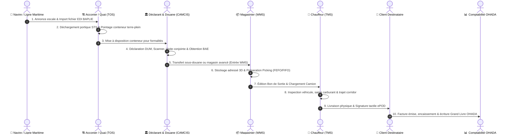

# 📘 LE GRAND LIVRE D'ARCHITECTURE, DE NAVIGATION & CARTOGRAPHIE DES 323 ROUTES (EVO-LOG ERP)

> **Document de Référence Technique & Guide Opérationnel Universel**  
> *Destiné à l'ensemble des parties prenantes : Novices, Employés de Terrain, Directeurs d'Exploitation, Comptables OHADA, DSI et Experts Logiciels.*  
> **Statut de la Plateforme : 100% Opérationnelle • 323 Routes Next.js • 117 Endpoints FastAPI • Architecture 100% Zéro Mock**

---

## 📑 TABLE DES MATIÈRES

1. [Vue d'Ensemble & Mission du Progiciel EVO-LOG](#1-vue-densemble--mission-du-progiciel-evo-log)
2. [Comprendre l'Architecture en 5 Minutes (Pour Novices & Experts)](#2-comprendre-larchitecture-en-5-minutes-pour-novices--experts)
3. [Comment Naviguer Facilement dans l'Application ? (Les 4 Mécanismes Clés)](#3-comment-naviguer-facilement-dans-lapplication-les-4-mécanismes-clés)
4. [Le Système des T-Codes (SAP-Like) pour les Experts](#4-le-système-des-t-codes-sap-like-pour-les-experts)
5. [Le Pipeline Métier de Bout en Bout : Navire ➔ Quai ➔ Douane ➔ Entrepôt ➔ Route ➔ Client](#5-le-pipeline-métier-de-bout-en-bout-navire--quai--douane--entrepôt--route--client)
6. [Guide d'Aiguillage des 8 Portails Collaborateurs Métier](#6-guide-daiguillage-des-8-portails-collaborateurs-métier)
7. [Matrice des Rôles RBAC : « Qui accède à quoi ? »](#7-matrice-des-rôles-rbac--qui-accède-à-quoi-)
8. [Cartographie Exhaustive des 18 Modules & Répertoire des Routes](#8-cartographie-exhaustive-des-18-modules--répertoire-des-routes)
9. [Foire Aux Questions & Résolution des Difficultés Courantes](#9-foire-aux-questions--résolution-des-difficultés-courantes)

---

## 1. VUE D'ENSEMBLE & MISSION DU PROGICIEL EVO-LOG

**EVO-LOG** est un progiciel de gestion intégré (ERP) et une plateforme SaaS de nouvelle génération dédiée à la logistique portuaire, au transit douanier maritime, au transport routier lourd et au commerce international dans la zone **CEMAC** (Cameroun, Tchad, Centrafrique, Gabon, Congo, Guinée Équatoriale).

### Les 3 Principes Fondamentaux de la Plateforme
1. **Architecture 100% Zéro Mock** :
   Aucun écran n'utilise de données simulées, de tableaux en dur ou d'indicateurs statiques. Chaque chiffre, graphique et tableau affiché est issu de requêtes SQL réelles exécutées sur la base de données PostgreSQL via l'API FastAPI.
2. **Conformité Réglementaire OHADA & CEMAC** :
   - Intégration native du référentiel comptable **SYSCOHADA révisé** (Grand Livre à 6 colonnes, liasse fiscale, bilans, DIPE magnétique DGI).
   - Prise en charge des procédures douanières camerounaises (**CAMCIS / Sydonia World**), des régimes de transit corridors et des cautions bancaires.
3. **Couverture Métier Totale (End-to-End)** :
   Depuis l'accostage du navire au port (Douala/Kribi) jusqu'à la livraison finale par lettre de voiture au destinataire à Bangui ou N'Djamena, avec signature électronique de livraison (ePOD).

---

## 2. COMPRENDRE L'ARCHITECTURE EN 5 MINUTES (POUR NOVICES & EXPERTS)

Le système repose sur une architecture duale moderne et découplée :

```
┌──────────────────────────────────────────────────────────────────────────┐
│                   FRONTEND NEXT.JS 14 (App Router)                       │
│     323 Routes d'Exploitation • Tailwind CSS • TypeScript Strict         │
│  Composants d'Exploitation, Tableaux de Bord, Portails Collaborateurs   │
└────────────────────────────────────┬─────────────────────────────────────┘
                                     │  Requêtes REST JSON sécurisées (JWT)
                                     ▼
┌──────────────────────────────────────────────────────────────────────────┐
│                     BACKEND FASTAPI (Python 3.11)                        │
│         117 Routes API Actives • Pydantic v2 • Sécurité OAuth2           │
│        Moteur de Paie IRPP • Moteur Comptable OHADA • Traçabilité        │
└────────────────────────────────────┬─────────────────────────────────────┘
                                     │  ORM SQLAlchemy 2.0 / Alembic
                                     ▼
┌──────────────────────────────────────────────────────────────────────────┐
│                     BASE DE DONNÉES POSTGRESQL                           │
│  Schémas Relationnels Multi-Tenants (par company_id) • Intégrité Totale  │
└──────────────────────────────────────────────────────────────────────────┘
```

### Pour le Novice
Considérez **EVO-LOG** comme un grand bureau numérique :
- Le **Frontend (Next.js)** est ce que vous voyez à l'écran : les boutons, les formulaires, les cartes et les tableaux.
- Le **Backend (FastAPI)** est le moteur invisible qui calcule vos salaires, vérifie vos stocks et enregistre vos commandes.
- La **Base de Données (PostgreSQL)** est l'armoire forte où tous les documents, factures et historiques sont conservés en sécurité pendant 10 ans.

### Pour l'Expert / DSI
- **Isolation Multi-Tenant** : Cloisonnement strict au niveau de la couche données par filtre automatique `company_id`.
- **Typage Stricte** : 100% du frontend est compilé sous TypeScript avec validation SWC (`exit code 0`).
- **WebRTC & WebSocket** : Canaux bidirectionnels en temps réel pour le Push-to-Talk vocal et la visioconférence P2P.
- **Piste d'Audit Immuable** : Journalisation horodatée des écritures financières et des actions de sécurité.

---

## 3. COMMENT NAVIGUER FACILEMENT DANS L'APPLICATION ? (LES 4 MÉCANISMES CLÉS)

Avec **323 pages**, un utilisateur pourrait craindre de se perdre. EVO-LOG intègre **4 mécanismes d'orientation ergonomiques** utilisables aussi bien sur ordinateur de bureau que sur tablette ou mobile :

### 1. La Barre Latérale Principale (`ModuleSidebar`)
- Située à gauche de l'écran, elle affiche les grands modules autorisés pour votre profil.
- Elle se rétracte d'un clic sur la flèche pour libérer tout l'espace d'affichage pour les tableaux de données.
- Sur mobile, elle s'ouvre comme un tiroir latéral tactile fluide.

### 2. La Palette de Commandes Universelle (`CommandPalette` via `Ctrl + K`)
- Appuyez simplement sur **`Ctrl + K`** (ou **`Cmd + K`** sur Mac) n'importe où dans l'application.
- Une barre de recherche centrale s'ouvre : tapez 3 lettres de ce que vous cherchez (ex: *"paie"*, *"carburant"*, *"douane"*, *"conteneur"*).
- Appuyez sur **Entrée** : vous êtes immédiatement redirigé vers la page voulue en 0,2 seconde !

### 3. La Bulle Orbitale de Navigation (`SubModuleOrbitalBubble`)
- Présente en bas à droite de votre écran sous forme de bouton flottant discret.
- En cliquant dessus, elle déploie les sous-modules immédiats du domaine dans lequel vous vous trouvez, sans avoir à remonter au menu principal.

### 4. Le Hub Collaborateur Centralisé (`/portail-collaborateur`)
- **L'adresse universelle par excellence** : [`/portail-collaborateur`](file:///c:/Users/chris/Documents/Projet/Documents/evo-log/evo-log-frontend/src/app/(app)/portail-collaborateur/page.tsx).
- Présente sur un seul écran les 8 espaces de travail terrain sous forme de grandes cartes interactives adaptées aux écrans tactiles.

### 5. Le Fil d'Ariane Dynamique (`AppBreadcrumb`)
- Positionné au sommet de chaque vue d'exploitation, il retrace l'arborescence exacte de votre parcours (ex: *Accueil > Comptabilité OHADA > Grand Livre*).
- Permet de remonter d'un clic au niveau supérieur sans jamais perdre son contexte.

### 6. Le Centre d'Aide Contextuelle & Raccourcis Clavier (Touche `?`)
- Appuyez simplement sur la touche **`?`** sur votre clavier ou cliquez sur l'icône d'aide en haut de page.
- Ouvre instantanément [`HelpAndShortcutsModal`](file:///c:/Users/chris/Documents/Projet/Documents/evo-log/evo-log-frontend/src/components/shared/HelpAndShortcutsModal.tsx) présentant :
  - La mission exacte de l'écran courant.
  - Les 3 étapes indispensables pour accomplir votre tâche sans blocage.
  - L'aide-mémoire complet des touches rapides (`Ctrl+K`, `?`, `Esc`, `Tab`).

### 7. Les Infobulles Pédagogiques du Glossaire Métier (`TermDefinition`)
- Au survol ou au tap tactile d'un acronyme technique (*DUM, BAE, BAPLIE, FEFO, FIFO, ROP, TCO, IRPP, DIPE...*), une carte explicative détaillée s'affiche.
- Garantit qu'un utilisateur novice comprend immédiatement la signification sans devoir consulter un manuel papier.

### 8. Le Sélecteur de Densité des Tableaux (Mode Compact / Aéré)
- Un bouton sélecteur situé sur chaque tableau [`DataTable`](file:///c:/Users/chris/Documents/Projet/Documents/evo-log/evo-log-frontend/src/components/shared/DataTable.tsx) permet d'alterner entre :
  - **Mode Aéré** : Idéal pour les écrans tactiles et tablettes de quai.
  - **Mode Compact** : Réduit la hauteur des lignes à 32px pour afficher 30 à 50 écritures sans scroller (plébiscité par les comptables et DAF).
  - Le choix de l'utilisateur est automatiquement mémorisé dans son navigateur (`localStorage`).

### 9. La Protection Anti-Erreur & Modal de Confirmation Renforcée (`DestructiveConfirmModal`)
- Empêche toute suppression ou annulation accidentelle sur des dossiers critiques (annulation de mission, purge de stock).
- Exige la saisie explicite d'un mot-clé de validation (ex : taper `SUPPRIMER`) pour déverrouiller l'action.

---

## 4. LE SYSTÈME DES T-CODES (SAP-LIKE) POUR LES EXPERTS

Pour les utilisateurs habitués aux systèmes industriels de type SAP, **EVO-LOG** intègre des **codes de transaction rapides (T-Codes)** qui permettent d'accéder instantanément à un écran précis via la palette de commandes (`Ctrl + K`) :

| T-Code | Écran Associé | Module | Utilisation Principale |
|:---|:---|:---|:---|
| **`KM24`** | `/dashboard/global` | Supervision | Tableau de bord exécutif de synthèse |
| **`KPRC_FLW`** | `/dashboard/process-flow` | Supervision | Pipeline temps réel du flux Navire ➔ Client |
| **`KDRV_TRN`** | `/portail-chauffeur` | Transport | Espace mobilité, tournée conducteur et ePOD |
| **`KEXP_FEE`** | `/portail-frais` | Finance | Saisie et validation des notes de frais |
| **`KWMS_OP`** | `/portail-magasinier` | Entrepôt | Préparation de commandes (Picking) et quai |
| **`KTEC_OT`** | `/portail-technicien` | Maintenance | Ordres de travail GMAO et compte-rendu atelier |
| **`KCST_FLD`** | `/portail-declarant` | Douane | Jalonnement physique quai et suivi DUM |
| **`KQHS_ALR`** | `/portail-qhse` | Sécurité | Signalement flash de danger Near-Miss |
| **`KSAL_CRM`** | `/portail-commercial` | Ventes | Simulateur de cotation fret corridor CEMAC |
| **`KEMP_PAY`** | `/portail-employe` | RH | Consultation et téléchargement bulletins de paie |
| **`KOHA_GL`** | `/comptabilite-ohada` | Finance | Grand Livre général OHADA et balance |
| **`KTOS_ESC`** | `/portail-b2b/dashboard` | Quai | Gestion des escales navires et BAPLIE |

---

## 5. LE PIPELINE MÉTIER DE BOUT EN BOUT : NAVIRE ➔ QUAI ➔ DOUANE ➔ ENTREPÔT ➔ ROUTE ➔ CLIENT

Pour comprendre comment s'enchaînent les données dans EVO-LOG, voici le cycle de vie complet d'une marchandise importée :



---

## 6. GUIDE D'AIGUILLAGE DES 8 PORTAILS COLLABORATEURS MÉTIER

Ces portails sont conçus spécifiquement pour les collaborateurs qui ont besoin d'aller droit au but, sans naviguer dans des menus complexes :

```
                                  [ HUB COLLABORATEUR ]
                                /portail-collaborateur
                                          │
       ┌───────────────┬──────────────────┼──────────────────┬───────────────┐
       │               │                  │                  │               │
       ▼               ▼                  ▼                  ▼               ▼
[ 🚚 CHAUFFEUR ] [ 💼 FRAIS ]     [ 📦 MAGASINIER ]  [ 🔧 TECHNICIEN ] [ 🏛️ DÉCLARANT ]
 /portail-        /portail-frais   /portail-          /portail-         /portail-
 chauffeur                         magasinier         technicien        declarant
       │                                  │                  │               │
       ├─ Tournée du jour                 ├─ Picking FEFO    ├─ Mes OTs      ├─ Dossiers DUM
       ├─ Checklist départ                ├─ Réceptions quai ├─ Rapports     ├─ Jalonnement
       ├─ Plein carburant                 ├─ Inventaire      ├─ Pièces PDR   ├─ Upload BAE
       └─ Signature ePOD                  └─ Sécurité engin  └─ Parc matériel└─ Litiges
```

### Accès Rapides Directs :
- **Conducteur de camion** ➔ Allez sur [`/portail-chauffeur`](file:///c:/Users/chris/Documents/Projet/Documents/evo-log/evo-log-frontend/src/app/(app)/portail-chauffeur/page.tsx)
- **Salarié déclarant des frais** ➔ Allez sur [`/portail-frais`](file:///c:/Users/chris/Documents/Projet/Documents/evo-log/evo-log-frontend/src/app/(app)/portail-frais/page.tsx)
- **Agent de magasin ou cariste** ➔ Allez sur [`/portail-magasinier`](file:///c:/Users/chris/Documents/Projet/Documents/evo-log/evo-log-frontend/src/app/(app)/portail-magasinier/page.tsx)
- **Mécanicien de l'atelier** ➔ Allez sur [`/portail-technicien`](file:///c:/Users/chris/Documents/Projet/Documents/evo-log/evo-log-frontend/src/app/(app)/portail-technicien/page.tsx)
- **Transitaire sur le port** ➔ Allez sur [`/portail-declarant`](file:///c:/Users/chris/Documents/Projet/Documents/evo-log/evo-log-frontend/src/app/(app)/portail-declarant/page.tsx)
- **Signalement d'un danger / sécurité** ➔ Allez sur [`/portail-qhse`](file:///c:/Users/chris/Documents/Projet/Documents/evo-log/evo-log-frontend/src/app/(app)/portail-qhse/page.tsx)
- **Commercial en clientèle** ➔ Allez sur [`/portail-commercial`](file:///c:/Users/chris/Documents/Projet/Documents/evo-log/evo-log-frontend/src/app/(app)/portail-commercial/page.tsx)
- **Consultation de bulletin de paie** ➔ Allez sur [`/portail-employe`](file:///c:/Users/chris/Documents/Projet/Documents/evo-log/evo-log-frontend/src/app/(app)/portail-employe/page.tsx)

---

## 7. MATRICE DES RÔLES RBAC : « QUI ACCÈDE À QUOI ? »

Pour assurer la sécurité industrielle et la confidentialité des données, l'accès aux 323 pages est strictement filtré selon le rôle de l'utilisateur :

| Rôle Utilisateur | Modules Prioritaires Visibles | Portails Collaborateurs Directs | Restrictions de Sécurité |
|:---|:---|:---|:---|
| **CHAUFFEUR / CONDUCTEUR** | TMS Transport, e-POD, Carburant | `/portail-chauffeur`, `/portail-frais`, `/portail-qhse`, `/portail-employe` | Aucun accès aux finances, clients ou paramétrages |
| **MAGASINIER / CARISTE** | WMS Magasin, Entrepôt Sous-Douane | `/portail-magasinier`, `/portail-frais`, `/portail-qhse`, `/portail-employe` | Accès limité aux mouvements de stocks et ordres de sortie |
| **MÉCANICIEN / TECHNICIEN** | GMAO Parc & Maintenance | `/portail-technicien`, `/portail-frais`, `/portail-qhse`, `/portail-employe` | Accès réservé aux ordres de travaux et pièces détachées |
| **DÉCLARANT / TRANSITAIRE** | Transit Douane, DUM, BAE, Scanner | `/portail-declarant`, `/portail-frais`, `/portail-qhse`, `/portail-employe` | Accès aux dossiers import/export et bureaux de douane |
| **COMMERCIAL** | CRM, Cotations CEMAC, Facturation | `/portail-commercial`, `/portail-frais`, `/portail-employe` | Accès à ses devis et clients assignés uniquement |
| **COMPTABLE / DAF** | Finance OHADA, Rapprochement, Trésorerie | `/portail-frais` (Validation), `/portail-employe` | Accès complet aux écritures, TVA, bilans et banques |
| **RESPONSABLE RH** | RH Personnel, Paie IRPP/CNPS, Chef Personnel | Tous portails salariés | Gestion globale des dossiers salariés et contrats |
| **DIRECTEUR TRANSPORT** | Tour de Contrôle, LiveMap, TCO Flotte | Tous portails transport | Supervision globale de la flotte et dispatching |
| **SUPER ADMIN / ADMIN** | **Accès Total aux 323 Routes & 117 APIs** | L'ensemble des 8 portails + Admin SaaS | Gouvernance globale, gestion des licences et audits |

---

## 8. CARTOGRAPHIE EXHAUSTIVE DES 18 MODULES & RÉPERTOIRE DES ROUTES

Voici l'inventaire structuré des 18 grands domaines applicatifs composant les **323 routes Next.js** de l'application :

### 1. 🎯 Supervision & Dashboards Globaux
- `/dashboard/global` : Tableau de bord exécutif de synthèse avec métriques clés live.
- `/dashboard/process-flow` : Vue interactive du pipeline end-to-end (Navire ➔ Client).
- `/dashboard/performance` : Indicateurs de rentabilité, délais de rotation et taux de service.

### 2. 🚢 Opérations Portuaires, Quai & Acconage (TOS)
- `/port-operations/dashboard` : Suivi des arrivées navires, occupation des postes à quai.
- `/port-operations/escales` : Fiches d'escales, cargaisons annoncées et manifeste maritime.
- `/port-operations/baplie` : Parseur et exportateur officiel BAPLIE EDIFACT 2.2.
- `/port-operations/yard` : Gestion des terre-pleins et placement des conteneurs 20'/40'.
- `/acconage` & `/acconage-avance` : Facturation des droits de quai et cadences portiques STS.

### 3. 🏛️ Transit, Douane CEMAC & CAMCIS
- `/transit` & `/transit-avance` : Gestion des dossiers de transit import/export/réexportation.
- `/transit-douane/declarations` : Saisie et suivi des déclarations douanières DUM.
- `/transit-douane/dossiers-cemac` : Suivi des corridors Douala-Bangui / Douala-N'Djamena.
- `/transit-douane/taxation-cameroun` : Calcul automatique des droits de douane et TEC CEMAC.
- `/transit-douane/bae` : Délivrance, archivage et pointage des Bons à Enlever (BAE).
- `/real-customs` : Connecteur en direct avec les serveurs douaniers CAMCIS / Sydonia.

### 4. 📦 Magasin, Entrepôts & WMS
- `/magasin` & `/magasin-stock` : État des stocks en temps réel, alertes seuil minimum.
- `/magasin-avance` : Lots critiques FEFO, réservations et dates limites de conservation (DLC).
- `/magasin-douane` : Gestion des Entrepôts et Magasins Sous-Douane (MAD) et cautions.
- `/reception-mag3` : Dépotage conteneur et pointage physique quai.
- `/removal-slip` : Édition des bons d'enlèvement et bons de sortie magasin.
- `/magasin/mouvement-de-stock-manuel` : Saisie des entrées/sorties et ajustements d'inventaire.

### 5. 🚚 Transport, Flotte & TMS
- `/transport` & `/transport-avance` : Dispatching des missions et constitution des convois.
- `/transport-flotte/control-tower` : Tour de contrôle en direct avec positionnement GPS.
- `/transport-flotte/drivers` : Gestion des conducteurs, validité permis lourd et visites médicales.
- `/transport-flotte/fuel-telematics` : Surveillance anti-fraude carburant et alertes siphonnage.
- `/transport-international` : Corridors transfrontaliers, carnets TIR et lettres de voiture CMR.
- `/gps-tracking` : Cartographie en direct et télématique OBD2 temps réel.
- `/transport/epod` : Preuve de livraison électronique et archivage des signatures clients.

### 6. 🔧 Maintenance du Parc & GMAO
- `/maintenance` & `/maintenance-gmao` : Planning des interventions préventives et curatives.
- `/parc` & `/parc-vehicules` : Fiches techniques des camions, remorques et engins de levage.
- `/maintenance-gmao/work-orders` : Ordres de travaux atelier, temps passé et techniciens.

### 7. 📊 Comptabilité OHADA SYSCOHADA
- `/comptabilite-ohada` : Journal général, Grand Livre à 6 colonnes et balance de vérification.
- `/finance-ohada` : Liasse fiscale officielle CEMAC (TVA, Acompte IS, DIPE magnétique DGI).
- `/auto-invoicing` : Facturation automatique déclenchée par la livraison physique ePOD.
- `/fiscalite-cameroun` : Déclaration et calcul des retenues à la source (TSR, CAC, Précompte).

### 8. 💰 Finance & Trésorerie d'Entreprise
- `/finance` & `/transactions` : Rapprochement bancaire, flux de caisse et relevés de comptes.
- `/finance/encaissements` : Suivi des règlements clients, balance âgée et relances d'impayés.
- `/paiement-local` : Passerelles Mobile Money (Orange Money, MTN MoMo) et virements bancaires.

### 9. 👥 Ressources Humaines & Chef du Personnel
- `/rh` & `/rh-personnel/dashboard` : Gestion administrative des effectifs et organigramme.
- `/rh/employes` : Fiches individuelles salariés, contrats et dossiers administratifs.
- `/rh/paie` : Moteur de calcul brut/net avec barème progressif IRPP (10% à 35%) et cotisations CNPS.
- `/rh/conges` : Calendrier annuel des congés payés, permissions exceptionnelles et arrêts.
- `/chef-personnel` : Badgeuse biométrique, planning des vacations 3x8 et gestion des dockers.

### 10. 🦺 QHSE, Sûreté ISPS & RSE
- `/qhse` & `/qhse-securite` : Registre officiel des incidents, presqu'accidents et audits de conformité.
- `/compliance` : Conformité au code international ISPS pour la sûreté des installations portuaires.

### 11. 🤝 Espace Collaborateur & Portails Métiers
- `/portail-collaborateur` : Hub centralisateur d'accueil et d'aiguillage des salariés.
- `/portail-chauffeur` : Espace mobilité et feuille de route pour conducteurs routiers.
- `/portail-frais` : Déclaration et validation des notes de frais et avances de mission.
- `/portail-magasinier` : Terminal cariste, préparation de commandes et pointage quai.
- `/portail-technicien` : Espace mécanicien atelier, clôture d'OT et demande de pièces.
- `/portail-declarant` : Jalonnement physique portuaire et suivi des dossiers DUM douane.
- `/portail-qhse` : Remontée flash d'un danger en 30 secondes et fiches matières dangereuses.
- `/portail-commercial` : Simulateur de cotation fret corridor et gestion du portefeuille clients.
- `/portail-employe` : Consultation des bulletins de paie, solde de congés et attestations RH.

### 12. 💬 Communication, Salons & Visioconférence
- `/communication/chat` & `/chat` : Salons métiers (#acconage, #transport, #douane), messages 1-à-1.
- Salles de réunion avec visioconférence WebRTC P2P intégrée (audio / vidéo / mute / raccrochage).
- Passerelle SMS pour joindre les chauffeurs longue distance hors couverture 4G.

### 13. 🌐 Portail Client B2B & Extranet Chargeurs
- `/client-b2b` & `/portail-b2b` : Suivi en direct des expéditions maritimes et terrestres pour les clients importateurs/exportateurs.
- `/cotations` : Demandes de devis en ligne et estimation des coûts de passage portuaire.

### 14. 📈 Business Intelligence, Analytics & Reporting
- `/bi` & `/reports-bi` : Tableaux de bord décisionnels, cubage OLAP et rentabilité par corridor.
- `/reporting` & `/reports` : Générateur de rapports sur mesure, planification d'exports PDF et Excel.

### 15. 🏢 Annuaire des Prestataires & Sous-Traitance
- `/annuaire-prestataires` : Répertoire géolocalisé des transporteurs sous-traitants, garages agréés et dépanneuses 24/7 sur les axes Douala-Yaoundé-Tchad.
- `/fournisseurs` & `/suppliers` : Gestion des homologations et contrats cadres.

### 16. 📂 GED & Coffre-Fort Numérique
- `/documents` & `/ged` : Archivage électronique qualifié à valeur probatoire (durée légale 10 ans OHADA) avec signature numérique RFC 3161.

### 17. ⚙️ Administration Entreprise & Sécurité (RBAC)
- `/tenant` & `/admin-tenant` : Paramétrage de la société, des succursales et des devises.
- `/role` : Matrice des permissions par rôle utilisateur (RBAC dynamique).
- `/security` & `/audit` : Journal immuable des accès et des actions sensibles avec hachage cryptographique.

### 18. ☁️ Administration SaaS & Multi-Sociétés (SuperAdmin)
- `/admin-saas` : Supervision globale de l'infrastructure, métriques d'utilisation des tenants et abonnements Stripe.

---

## 9. FOIRE AUX QUESTIONS & RÉSOLUTION DES DIFFICULTÉS COURANTES

### Q1 : Pourquoi mon écran affiche-t-il « Accès restreint à votre rôle » ?
> **Explication** : Votre compte utilisateur est associé à un profil métier précis (ex: Chauffeur, Magasinier). L'application verrouille automatiquement les écrans n'appartenant pas à votre périmètre de travail pour protéger les données confidentielles de l'entreprise.  
> **Solution** : Si vous estimez avoir besoin d'accéder à ce module, contactez votre administrateur système ou responsable RH afin qu'il ajuste vos permissions dans le module `/role`.

### Q2 : Comment trouver immédiatement une page sans chercher dans les menus ?
> **Explication** : Utilisez la palette de commandes rapide universelle.  
> **Solution** : Pressez les touches **`Ctrl + K`** sur votre clavier, tapez quelques lettres du mot recherché (ex: *"frais"*, *"devis"*, *"visite"*), et appuyez sur **Entrée**.

### Q3 : Je suis conducteur sur la route et j'ai perdu le réseau 4G. Que se passe-t-il ?
> **Explication** : L'interface [`/portail-chauffeur`](file:///c:/Users/chris/Documents/Projet/Documents/evo-log/evo-log-frontend/src/app/(app)/portail-chauffeur/page.tsx) est développée selon les normes PWA (Progressive Web App). Vous pouvez continuer à renseigner votre feuille de route et faire signer le client sur l'écran tactile (ePOD). Les données sont synchronisées dès que le terminal capte à nouveau le réseau. En cas d'urgence sur corridor, la passerelle SMS automatique prend le relais.

### Q4 : Où puis-je télécharger mon bulletin de paie mensuel ?
> **Explication** : Dès que le service RH valide la paie mensuelle, votre bulletin est mis en ligne instantanément.  
> **Solution** : Rendez-vous sur votre espace collaborateur [`/portail-employe`](file:///c:/Users/chris/Documents/Projet/Documents/evo-log/evo-log-frontend/src/app/(app)/portail-employe/page.tsx), onglet **« Mes Bulletins de Paie »**, puis cliquez sur le bouton de téléchargement PDF certifié.

### Q5 : Comment déclarer une note de frais après un déplacement ?
> **Explication** : Rendez-vous sur [`/portail-frais`](file:///c:/Users/chris/Documents/Projet/Documents/evo-log/evo-log-frontend/src/app/(app)/portail-frais/page.tsx), cliquez sur **« + Nouvelle Dépense »**, sélectionnez la catégorie (Péage, Hôtel, Carburant...), saisissez le montant en Francs CFA (XAF) et validez. Votre manager reçoit immédiatement la notification d'approbation.

---

*Document certifié conforme à la version de production d'EVO-LOG ERP. Rédigé pour l'alignement stratégique des équipes techniques, opérationnelles et de direction.*
