# 📘 LE GRAND LIVRE D'ARCHITECTURE, DE NAVIGATION & CARTOGRAPHIE DES 323 ROUTES (EVO-LOG ERP)

> **Document de Référence Technique & Guide Opérationnel Universel**  
> *Destiné à l'ensemble des parties prenantes : Novices, Employés de Terrain, Directeurs d'Exploitation, Comptables OHADA, DSI et Experts Logiciels.*  
> **Statut vérifié au 20 septembre 2026 : développement avancé, non certifié production.**  
> Les nombres de routes et endpoints sont des inventaires historiques ; la couverture réelle des contrats frontend/backend, la persistance métier et les validations PostgreSQL/Redis doivent être vérifiées dans [`ETAT_REEL_2026-09-20.md`](./ETAT_REEL_2026-09-20.md).

---

## 📑 TABLE DES MATIÈRES

1. [Vue d'Ensemble & Mission du Progiciel EVO-LOG](#1-vue-densemble--mission-du-progiciel-evo-log)
2. [Comprendre l'Architecture en 5 Minutes (Pour Novices & Experts)](#2-comprendre-larchitecture-en-5-minutes-pour-novices--experts)
3. [Comment Naviguer Facilement dans l'Application ? (Les 4 Mécanismes Clés)](#3-comment-naviguer-facilement-dans-lapplication-les-4-mécanismes-clés)
4. [Le Système des T-Codes (SAP-Like) pour les Experts](#4-le-système-des-t-codes-sap-like-pour-les-experts)
5. [Le Pipeline Métier de Bout en Bout : Navire ➔ Quai ➔ Douane ➔ Entrepôt ➔ Route ➔ Client](#5-le-pipeline-métier-de-bout-en-bout-navire--quai--douane--entrepôt--route--client)
6. [Guide d'Aiguillage des 8 Portails Collaborateurs Métier](#6-guide-daiguillage-des-8-portails-collaborateurs-métier)
7. [Matrice des Rôles RBAC : « Qui accède à quoi ? »](#7-matrice-des-rôles-rbac--qui-accède-à-quoi-)
8. [Cartographie Exhaustive des 18 Modules & Répertoire des Routes](#8-cartographie-exhaustive-des-18-modules--répertoire-des-routes)
9. [Foire Aux Questions & Résolution des Difficultés Courantes](#9-foire-aux-questions--résolution-des-difficultés-courantes)

---

## 1. VUE D'ENSEMBLE & MISSION DU PROGICIEL EVO-LOG

**EVO-LOG** est un progiciel de gestion intégré (ERP) et une plateforme SaaS de nouvelle génération dédiée à la logistique portuaire, au transit douanier maritime, au transport routier lourd et au commerce international dans la zone **CEMAC** (Cameroun, Tchad, Centrafrique, Gabon, Congo, Guinée Équatoriale).

### Les 3 Principes Fondamentaux de la Plateforme
1. **Architecture orientée données réelles** :
   Les écrans audités n'affichent plus leurs jeux de démonstration les plus dangereux. Des modules restent incomplets ou dépendent d'endpoints absents ; ils doivent afficher une indisponibilité explicite plutôt qu'une donnée inventée.
2. **Conformité Réglementaire OHADA & CEMAC** :
   - Intégration native du référentiel comptable **SYSCOHADA révisé** (Grand Livre à 6 colonnes, liasse fiscale, bilans, DIPE magnétique DGI).
   - Prise en charge des procédures douanières camerounaises (**CAMCIS / Sydonia World**), des régimes de transit corridors et des cautions bancaires.
3. **Couverture Métier Totale (End-to-End)** :
   Depuis l'accostage du navire au port (Douala/Kribi) jusqu'à la livraison finale par lettre de voiture au destinataire à Bangui ou N'Djamena, avec signature électronique de livraison (ePOD).

---

## 2. COMPRENDRE L'ARCHITECTURE EN 5 MINUTES (POUR NOVICES & EXPERTS)

Le système repose sur une architecture duale moderne et découplée :

```
┌──────────────────────────────────────────────────────────────────────────┐
│                   FRONTEND NEXT.JS 14 (App Router)                       │
│     323 Routes d'Exploitation • Tailwind CSS • TypeScript Strict         │
│  Composants d'Exploitation, Tableaux de Bord, Portails Collaborateurs   │
└────────────────────────────────────┬─────────────────────────────────────┘
                                     │  Requêtes REST JSON sécurisées (JWT)
                                     â–¼
┌──────────────────────────────────────────────────────────────────────────┐
│                     BACKEND FASTAPI (Python 3.11)                        │
│         117 Routes API Actives • Pydantic v2 • Sécurité OAuth2           │
│        Moteur de Paie IRPP • Moteur Comptable OHADA • Traçabilité        │
└────────────────────────────────────┬─────────────────────────────────────┘
                                     │  ORM SQLAlchemy 2.0 / Alembic
                                     â–¼
┌──────────────────────────────────────────────────────────────────────────┐
│                     BASE DE DONNÉES POSTGRESQL                           │
│  Schémas Relationnels Multi-Tenants (par company_id) • Intégrité Totale  │
└──────────────────────────────────────────────────────────────────────────┘
```

### Pour le Novice
Considérez **EVO-LOG** comme un grand bureau numérique :
- Le **Frontend (Next.js)** est ce que vous voyez à l'écran : les boutons, les formulaires, les cartes et les tableaux.
- Le **Backend (FastAPI)** est le moteur invisible qui calcule vos salaires, vérifie vos stocks et enregistre vos commandes.
- La **Base de Données (PostgreSQL)** est l'armoire forte où tous les documents, factures et historiques sont conservés en sécurité pendant 10 ans.

### Pour l'Expert / DSI
- **Isolation Multi-Tenant** : Cloisonnement strict au niveau de la couche données par filtre automatique `company_id`.
- **Typage Stricte** : 100% du frontend est compilé sous TypeScript avec validation SWC (`exit code 0`).
- **WebRTC & WebSocket** : Canaux bidirectionnels en temps réel pour le Push-to-Talk vocal et la visioconférence P2P.
- **Piste d'Audit Immuable** : Journalisation horodatée des écritures financières et des actions de sécurité.

---

## 3. COMMENT NAVIGUER FACILEMENT DANS L'APPLICATION ? (LES 4 MÉCANISMES CLÉS)

Avec **323 pages**, un utilisateur pourrait craindre de se perdre. EVO-LOG intègre **4 mécanismes d'orientation ergonomiques** utilisables aussi bien sur ordinateur de bureau que sur tablette ou mobile :

### 1. La Barre Latérale Principale (`ModuleSidebar`)
- Située à gauche de l'écran, elle affiche les grands modules autorisés pour votre profil.
- Elle se rétracte d'un clic sur la flèche pour libérer tout l'espace d'affichage pour les tableaux de données.
- Sur mobile, elle s'ouvre comme un tiroir latéral tactile fluide.

### 2. La Palette de Commandes Universelle (`CommandPalette` via `Ctrl + K`)
- Appuyez simplement sur **`Ctrl + K`** (ou **`Cmd + K`** sur Mac) n'importe où dans l'application.
- Une barre de recherche centrale s'ouvre : tapez 3 lettres de ce que vous cherchez (ex: *"paie"*, *"carburant"*, *"douane"*, *"conteneur"*).
- Appuyez sur **Entrée** : vous êtes immédiatement redirigé vers la page voulue en 0,2 seconde !

### 3. La Bulle Orbitale de Navigation (`SubModuleOrbitalBubble`)
- Présente en bas à droite de votre écran sous forme de bouton flottant discret.
- En cliquant dessus, elle déploie les sous-modules immédiats du domaine dans lequel vous vous trouvez, sans avoir à remonter au menu principal.

### 4. Le Hub Collaborateur Centralisé (`/portail-collaborateur`)
- **L'adresse universelle par excellence** : [`/portail-collaborateur`](file:///c:/Users/chris/Documents/Projet/Documents/evo-log/evo-log-frontend/src/app/(app)/portail-collaborateur/page.tsx).
- Présente sur un seul écran les 8 espaces de travail terrain sous forme de grandes cartes interactives adaptées aux écrans tactiles.

### 5. Le Fil d'Ariane Dynamique (`AppBreadcrumb`)
- Positionné au sommet de chaque vue d'exploitation, il retrace l'arborescence exacte de votre parcours (ex: *Accueil > Comptabilité OHADA > Grand Livre*).
- Permet de remonter d'un clic au niveau supérieur sans jamais perdre son contexte.

### 6. Le Centre d'Aide Contextuelle & Raccourcis Clavier (Touche `?`)
- Appuyez simplement sur la touche **`?`** sur votre clavier ou cliquez sur l'icône d'aide en haut de page.
- Ouvre instantanément [`HelpAndShortcutsModal`](file:///c:/Users/chris/Documents/Projet/Documents/evo-log/evo-log-frontend/src/components/shared/HelpAndShortcutsModal.tsx) présentant :
  - La mission exacte de l'écran courant.
  - Les 3 étapes indispensables pour accomplir votre tâche sans blocage.
  - L'aide-mémoire complet des touches rapides (`Ctrl+K`, `?`, `Esc`, `Tab`).

### 7. Les Infobulles Pédagogiques du Glossaire Métier (`TermDefinition`)
- Au survol ou au tap tactile d'un acronyme technique (*DUM, BAE, BAPLIE, FEFO, FIFO, ROP, TCO, IRPP, DIPE...*), une carte explicative détaillée s'affiche.
- Garantit qu'un utilisateur novice comprend immédiatement la signification sans devoir consulter un manuel papier.

### 8. Le Sélecteur de Densité des Tableaux (Mode Compact / Aéré)
- Un bouton sélecteur situé sur chaque tableau [`DataTable`](file:///c:/Users/chris/Documents/Projet/Documents/evo-log/evo-log-frontend/src/components/shared/DataTable.tsx) permet d'alterner entre :
  - **Mode Aéré** : Idéal pour les écrans tactiles et tablettes de quai.
  - **Mode Compact** : Réduit la hauteur des lignes à 32px pour afficher 30 à 50 écritures sans scroller (plébiscité par les comptables et DAF).
  - Le choix de l'utilisateur est automatiquement mémorisé dans son navigateur (`localStorage`).

### 9. La Protection Anti-Erreur & Modal de Confirmation Renforcée (`DestructiveConfirmModal`)
- Empêche toute suppression ou annulation accidentelle sur des dossiers critiques (annulation de mission, purge de stock).
- Exige la saisie explicite d'un mot-clé de validation (ex : taper `SUPPRIMER`) pour déverrouiller l'action.

---

## 4. LE SYSTÈME DES T-CODES (SAP-LIKE) POUR LES EXPERTS

Pour les utilisateurs habitués aux systèmes industriels de type SAP, **EVO-LOG** intègre des **codes de transaction rapides (T-Codes)** qui permettent d'accéder instantanément à un écran précis via la palette de commandes (`Ctrl + K`) :

| T-Code | Écran Associé | Module | Utilisation Principale |
|:---|:---|:---|:---|
| **`KM24`** | `/dashboard/global` | Supervision | Tableau de bord exécutif de synthèse |
| **`KPRC_FLW`** | `/dashboard/process-flow` | Supervision | Pipeline temps réel du flux Navire ➔ Client |
| **`KDRV_TRN`** | `/portail-chauffeur` | Transport | Espace mobilité, tournée conducteur et ePOD |
| **`KEXP_FEE`** | `/portail-frais` | Finance | Saisie et validation des notes de frais |
| **`KWMS_OP`** | `/portail-magasinier` | Entrepôt | Préparation de commandes (Picking) et quai |
| **`KTEC_OT`** | `/portail-technicien` | Maintenance | Ordres de travail GMAO et compte-rendu atelier |
| **`KCST_FLD`** | `/portail-declarant` | Douane | Jalonnement physique quai et suivi DUM |
| **`KQHS_ALR`** | `/portail-qhse` | Sécurité | Signalement flash de danger Near-Miss |
| **`KSAL_CRM`** | `/portail-commercial` | Ventes | Simulateur de cotation fret corridor CEMAC |
| **`KEMP_PAY`** | `/portail-employe` | RH | Consultation et téléchargement bulletins de paie |
| **`KOHA_GL`** | `/comptabilite-ohada` | Finance | Grand Livre général OHADA et balance |
| **`KTOS_ESC`** | `/portail-b2b/dashboard` | Quai | Gestion des escales navires et BAPLIE |

---

## 5. LE PIPELINE MÉTIER DE BOUT EN BOUT : NAVIRE ➔ QUAI ➔ DOUANE ➔ ENTREPÔT ➔ ROUTE ➔ CLIENT

Pour comprendre comment s'enchaînent les données dans EVO-LOG, voici le cycle de vie complet d'une marchandise importée :

```mermaid
sequenceDiagram
    autonumber
    actor Navire as 🚢 Navire / Ligne Maritime
    actor Quai as 🏗️ Acconier / Quai (TOS)
    actor Douane as 🏛️ Déclarant & Douane (CAMCIS)
    actor Entrepot as 📦 Magasinier (WMS)
    actor Transport as 🚚 Chauffeur (TMS)
    actor Client as 🤝 Client Destinataire
    actor Compta as 📊 Comptabilité OHADA

    Navire->>Quai: 1. Annonce escale & Import fichier EDI BAPLIE
    Quai->>Quai: 2. Déchargement portique STS & Pointage conteneur terre-plein
    Quai->>Douane: 3. Mise à disposition conteneur pour formalités
    Douane->>Douane: 4. Déclaration DUM, Scanner, Visite conjointe & Obtention BAE
    Douane->>Entrepot: 5. Transfert sous-douane ou magasin avancé (Entrée WMS)
    Entrepot->>Entrepot: 6. Stockage adressé 3D & Préparation Picking (FEFO/FIFO)
    Entrepot->>Transport: 7. Édition Bon de Sortie & Chargement Camion
    Transport->>Transport: 8. Inspection véhicule, saisie carburant & trajet corridor
    Transport->>Client: 9. Livraison physique & Signature tactile ePOD
    Client->>Compta: 10. Facture émise, encaissement & écriture Grand Livre OHADA
```



---

## 6. GUIDE D'AIGUILLAGE DES 8 PORTAILS COLLABORATEURS MÉTIER

Ces portails sont conçus spécifiquement pour les collaborateurs qui ont besoin d'aller droit au but, sans naviguer dans des menus complexes :

```
                                  [ HUB COLLABORATEUR ]
                                /portail-collaborateur
                                          │
       ┌───────────────┬──────────────────┼──────────────────┬───────────────┐
       │               │                  │                  │               │
       â–¼               â–¼                  â–¼                  â–¼               â–¼
[ 🚚 CHAUFFEUR ] [ 💼 FRAIS ]     [ 📦 MAGASINIER ]  [ 🔧 TECHNICIEN ] [ 🏛️ DÉCLARANT ]
 /portail-        /portail-frais   /portail-          /portail-         /portail-
 chauffeur                         magasinier         technicien        declarant
       │                                  │                  │               │
       ├─ Tournée du jour                 ├─ Picking FEFO    ├─ Mes OTs      ├─ Dossiers DUM
       ├─ Checklist départ                ├─ Réceptions quai ├─ Rapports     ├─ Jalonnement
       ├─ Plein carburant                 ├─ Inventaire      ├─ Pièces PDR   ├─ Upload BAE
       └─ Signature ePOD                  └─ Sécurité engin  └─ Parc matériel└─ Litiges
```

### Accès Rapides Directs :
- **Conducteur de camion** âž” Allez sur [`/portail-chauffeur`](file:///c:/Users/chris/Documents/Projet/Documents/evo-log/evo-log-frontend/src/app/(app)/portail-chauffeur/page.tsx)
- **Salarié déclarant des frais** ➔ Allez sur [`/portail-frais`](file:///c:/Users/chris/Documents/Projet/Documents/evo-log/evo-log-frontend/src/app/(app)/portail-frais/page.tsx)
- **Agent de magasin ou cariste** âž” Allez sur [`/portail-magasinier`](file:///c:/Users/chris/Documents/Projet/Documents/evo-log/evo-log-frontend/src/app/(app)/portail-magasinier/page.tsx)
- **Mécanicien de l'atelier** ➔ Allez sur [`/portail-technicien`](file:///c:/Users/chris/Documents/Projet/Documents/evo-log/evo-log-frontend/src/app/(app)/portail-technicien/page.tsx)
- **Transitaire sur le port** âž” Allez sur [`/portail-declarant`](file:///c:/Users/chris/Documents/Projet/Documents/evo-log/evo-log-frontend/src/app/(app)/portail-declarant/page.tsx)
- **Signalement d'un danger / sécurité** ➔ Allez sur [`/portail-qhse`](file:///c:/Users/chris/Documents/Projet/Documents/evo-log/evo-log-frontend/src/app/(app)/portail-qhse/page.tsx)
- **Commercial en clientèle** ➔ Allez sur [`/portail-commercial`](file:///c:/Users/chris/Documents/Projet/Documents/evo-log/evo-log-frontend/src/app/(app)/portail-commercial/page.tsx)
- **Consultation de bulletin de paie** âž” Allez sur [`/portail-employe`](file:///c:/Users/chris/Documents/Projet/Documents/evo-log/evo-log-frontend/src/app/(app)/portail-employe/page.tsx)

---

## 7. MATRICE DES RÔLES RBAC : « QUI ACCÈDE À QUOI ? »

Pour assurer la sécurité industrielle et la confidentialité des données, l'accès aux 323 pages est strictement filtré selon le rôle de l'utilisateur :

| Rôle Utilisateur | Modules Prioritaires Visibles | Portails Collaborateurs Directs | Restrictions de Sécurité |
|:---|:---|:---|:---|
| **CHAUFFEUR / CONDUCTEUR** | TMS Transport, e-POD, Carburant | `/portail-chauffeur`, `/portail-frais`, `/portail-qhse`, `/portail-employe` | Aucun accès aux finances, clients ou paramétrages |
| **MAGASINIER / CARISTE** | WMS Magasin, Entrepôt Sous-Douane | `/portail-magasinier`, `/portail-frais`, `/portail-qhse`, `/portail-employe` | Accès limité aux mouvements de stocks et ordres de sortie |
| **MÉCANICIEN / TECHNICIEN** | GMAO Parc & Maintenance | `/portail-technicien`, `/portail-frais`, `/portail-qhse`, `/portail-employe` | Accès réservé aux ordres de travaux et pièces détachées |
| **DÉCLARANT / TRANSITAIRE** | Transit Douane, DUM, BAE, Scanner | `/portail-declarant`, `/portail-frais`, `/portail-qhse`, `/portail-employe` | Accès aux dossiers import/export et bureaux de douane |
| **COMMERCIAL** | CRM, Cotations CEMAC, Facturation | `/portail-commercial`, `/portail-frais`, `/portail-employe` | Accès à ses devis et clients assignés uniquement |
| **COMPTABLE / DAF** | Finance OHADA, Rapprochement, Trésorerie | `/portail-frais` (Validation), `/portail-employe` | Accès complet aux écritures, TVA, bilans et banques |
| **RESPONSABLE RH** | RH Personnel, Paie IRPP/CNPS, Chef Personnel | Tous portails salariés | Gestion globale des dossiers salariés et contrats |
| **DIRECTEUR TRANSPORT** | Tour de Contrôle, LiveMap, TCO Flotte | Tous portails transport | Supervision globale de la flotte et dispatching |
| **SUPER ADMIN / ADMIN** | **Accès Total aux 323 Routes & 117 APIs** | L'ensemble des 8 portails + Admin SaaS | Gouvernance globale, gestion des licences et audits |

---

## 8. CARTOGRAPHIE EXHAUSTIVE DES 18 MODULES & RÉPERTOIRE DES ROUTES

Voici l'inventaire structuré des 18 grands domaines applicatifs composant les **323 routes Next.js** de l'application :

### 1. 🎯 Supervision & Dashboards Globaux
- `/dashboard/global` : Tableau de bord exécutif de synthèse avec métriques clés live.
- `/dashboard/process-flow` : Vue interactive du pipeline end-to-end (Navire âž” Client).
- `/dashboard/performance` : Indicateurs de rentabilité, délais de rotation et taux de service.

### 2. 🚢 Opérations Portuaires, Quai & Acconage (TOS)
- `/port-operations/dashboard` : Suivi des arrivées navires, occupation des postes à quai.
- `/port-operations/escales` : Fiches d'escales, cargaisons annoncées et manifeste maritime.
- `/port-operations/baplie` : Parseur et exportateur officiel BAPLIE EDIFACT 2.2.
- `/port-operations/yard` : Gestion des terre-pleins et placement des conteneurs 20'/40'.
- `/acconage` & `/acconage-avance` : Facturation des droits de quai et cadences portiques STS.

### 3. 🏛️ Transit, Douane CEMAC & CAMCIS
- `/transit` & `/transit-avance` : Gestion des dossiers de transit import/export/réexportation.
- `/transit-douane/declarations` : Saisie et suivi des déclarations douanières DUM.
- `/transit-douane/dossiers-cemac` : Suivi des corridors Douala-Bangui / Douala-N'Djamena.
- `/transit-douane/taxation-cameroun` : Calcul automatique des droits de douane et TEC CEMAC.
- `/transit-douane/bae` : Délivrance, archivage et pointage des Bons à Enlever (BAE).
- `/real-customs` : Connecteur en direct avec les serveurs douaniers CAMCIS / Sydonia.

### 4. 📦 Magasin, Entrepôts & WMS
- `/magasin` & `/magasin-stock` : État des stocks en temps réel, alertes seuil minimum.
- `/magasin-avance` : Lots critiques FEFO, réservations et dates limites de conservation (DLC).
- `/magasin-douane` : Gestion des Entrepôts et Magasins Sous-Douane (MAD) et cautions.
- `/reception-mag3` : Dépotage conteneur et pointage physique quai.
- `/removal-slip` : Édition des bons d'enlèvement et bons de sortie magasin.
- `/magasin/mouvement-de-stock-manuel` : Saisie des entrées/sorties et ajustements d'inventaire.

### 5. 🚚 Transport, Flotte & TMS
- `/transport` & `/transport-avance` : Dispatching des missions et constitution des convois.
- `/transport-flotte/control-tower` : Tour de contrôle en direct avec positionnement GPS.
- `/transport-flotte/drivers` : Gestion des conducteurs, validité permis lourd et visites médicales.
- `/transport-flotte/fuel-telematics` : Surveillance anti-fraude carburant et alertes siphonnage.
- `/transport-international` : Corridors transfrontaliers, carnets TIR et lettres de voiture CMR.
- `/gps-tracking` : Cartographie en direct et télématique OBD2 temps réel.
- `/transport/epod` : Preuve de livraison électronique et archivage des signatures clients.

### 6. 🔧 Maintenance du Parc & GMAO
- `/maintenance` & `/maintenance-gmao` : Planning des interventions préventives et curatives.
- `/parc` & `/parc-vehicules` : Fiches techniques des camions, remorques et engins de levage.
- `/maintenance-gmao/work-orders` : Ordres de travaux atelier, temps passé et techniciens.

### 7. 📊 Comptabilité OHADA SYSCOHADA
- `/comptabilite-ohada` : Journal général, Grand Livre à 6 colonnes et balance de vérification.
- `/finance-ohada` : Liasse fiscale officielle CEMAC (TVA, Acompte IS, DIPE magnétique DGI).
- `/auto-invoicing` : Facturation automatique déclenchée par la livraison physique ePOD.
- `/fiscalite-cameroun` : Déclaration et calcul des retenues à la source (TSR, CAC, Précompte).

### 8. 💰 Finance & Trésorerie d'Entreprise
- `/finance` & `/transactions` : Rapprochement bancaire, flux de caisse et relevés de comptes.
- `/finance/encaissements` : Suivi des règlements clients, balance âgée et relances d'impayés.
- `/paiement-local` : Passerelles Mobile Money (Orange Money, MTN MoMo) et virements bancaires.

### 9. 👥 Ressources Humaines & Chef du Personnel
- `/rh` & `/rh-personnel/dashboard` : Gestion administrative des effectifs et organigramme.
- `/rh/employes` : Fiches individuelles salariés, contrats et dossiers administratifs.
- `/rh/paie` : Moteur de calcul brut/net avec barème progressif IRPP (10% à 35%) et cotisations CNPS.
- `/rh/conges` : Calendrier annuel des congés payés, permissions exceptionnelles et arrêts.
- `/chef-personnel` : Badgeuse biométrique, planning des vacations 3x8 et gestion des dockers.

### 10. 🦺 QHSE, Sûreté ISPS & RSE
- `/qhse` & `/qhse-securite` : Registre officiel des incidents, presqu'accidents et audits de conformité.
- `/compliance` : Conformité au code international ISPS pour la sûreté des installations portuaires.

### 11. 🤝 Espace Collaborateur & Portails Métiers
- `/portail-collaborateur` : Hub centralisateur d'accueil et d'aiguillage des salariés.
- `/portail-chauffeur` : Espace mobilité et feuille de route pour conducteurs routiers.
- `/portail-frais` : Déclaration et validation des notes de frais et avances de mission.
- `/portail-magasinier` : Terminal cariste, préparation de commandes et pointage quai.
- `/portail-technicien` : Espace mécanicien atelier, clôture d'OT et demande de pièces.
- `/portail-declarant` : Jalonnement physique portuaire et suivi des dossiers DUM douane.
- `/portail-qhse` : Remontée flash d'un danger en 30 secondes et fiches matières dangereuses.
- `/portail-commercial` : Simulateur de cotation fret corridor et gestion du portefeuille clients.
- `/portail-employe` : Consultation des bulletins de paie, solde de congés et attestations RH.

### 12. 💬 Communication, Salons & Visioconférence
- `/communication/chat` & `/chat` : Salons métiers (#acconage, #transport, #douane), messages 1-à-1.
- Salles de réunion avec visioconférence WebRTC P2P intégrée (audio / vidéo / mute / raccrochage).
- Passerelle SMS pour joindre les chauffeurs longue distance hors couverture 4G.

### 13. 🌐 Portail Client B2B & Extranet Chargeurs
- `/client-b2b` & `/portail-b2b` : Suivi en direct des expéditions maritimes et terrestres pour les clients importateurs/exportateurs.
- `/cotations` : Demandes de devis en ligne et estimation des coûts de passage portuaire.

### 14. 📈 Business Intelligence, Analytics & Reporting
- `/bi` & `/reports-bi` : Tableaux de bord décisionnels, cubage OLAP et rentabilité par corridor.
- `/reporting` & `/reports` : Générateur de rapports sur mesure, planification d'exports PDF et Excel.

### 15. 🏢 Annuaire des Prestataires & Sous-Traitance
- `/annuaire-prestataires` : Répertoire géolocalisé des transporteurs sous-traitants, garages agréés et dépanneuses 24/7 sur les axes Douala-Yaoundé-Tchad.
- `/fournisseurs` & `/suppliers` : Gestion des homologations et contrats cadres.

### 16. 📂 GED & Coffre-Fort Numérique
- `/documents` & `/ged` : Archivage électronique qualifié à valeur probatoire (durée légale 10 ans OHADA) avec signature numérique RFC 3161.

### 17. ⚙️ Administration Entreprise & Sécurité (RBAC)
- `/tenant` & `/admin-tenant` : Paramétrage de la société, des succursales et des devises.
- `/role` : Matrice des permissions par rôle utilisateur (RBAC dynamique).
- `/security` & `/audit` : Journal immuable des accès et des actions sensibles avec hachage cryptographique.

### 18. ☁️ Administration SaaS & Multi-Sociétés (SuperAdmin)
- `/admin-saas` : Supervision globale de l'infrastructure, métriques d'utilisation des tenants et abonnements Stripe.

---

## 9. FOIRE AUX QUESTIONS & RÉSOLUTION DES DIFFICULTÉS COURANTES

### Q1 : Pourquoi mon écran affiche-t-il « Accès restreint à votre rôle » ?
> **Explication** : Votre compte utilisateur est associé à un profil métier précis (ex: Chauffeur, Magasinier). L'application verrouille automatiquement les écrans n'appartenant pas à votre périmètre de travail pour protéger les données confidentielles de l'entreprise.  
> **Solution** : Si vous estimez avoir besoin d'accéder à ce module, contactez votre administrateur système ou responsable RH afin qu'il ajuste vos permissions dans le module `/role`.

### Q2 : Comment trouver immédiatement une page sans chercher dans les menus ?
> **Explication** : Utilisez la palette de commandes rapide universelle.  
> **Solution** : Pressez les touches **`Ctrl + K`** sur votre clavier, tapez quelques lettres du mot recherché (ex: *"frais"*, *"devis"*, *"visite"*), et appuyez sur **Entrée**.

### Q3 : Je suis conducteur sur la route et j'ai perdu le réseau 4G. Que se passe-t-il ?
> **Explication** : L'interface [`/portail-chauffeur`](file:///c:/Users/chris/Documents/Projet/Documents/evo-log/evo-log-frontend/src/app/(app)/portail-chauffeur/page.tsx) est développée selon les normes PWA (Progressive Web App). Vous pouvez continuer à renseigner votre feuille de route et faire signer le client sur l'écran tactile (ePOD). Les données sont synchronisées dès que le terminal capte à nouveau le réseau. En cas d'urgence sur corridor, la passerelle SMS automatique prend le relais.

### Q4 : Où puis-je télécharger mon bulletin de paie mensuel ?
> **Explication** : Dès que le service RH valide la paie mensuelle, votre bulletin est mis en ligne instantanément.  
> **Solution** : Rendez-vous sur votre espace collaborateur [`/portail-employe`](file:///c:/Users/chris/Documents/Projet/Documents/evo-log/evo-log-frontend/src/app/(app)/portail-employe/page.tsx), onglet **« Mes Bulletins de Paie »**, puis cliquez sur le bouton de téléchargement PDF certifié.

### Q5 : Comment déclarer une note de frais après un déplacement ?
> **Explication** : Rendez-vous sur [`/portail-frais`](file:///c:/Users/chris/Documents/Projet/Documents/evo-log/evo-log-frontend/src/app/(app)/portail-frais/page.tsx), cliquez sur **« + Nouvelle Dépense »**, sélectionnez la catégorie (Péage, Hôtel, Carburant...), saisissez le montant en Francs CFA (XAF) et validez. Votre manager reçoit immédiatement la notification d'approbation.

---

*Document certifié conforme à la version de production d'EVO-LOG ERP. Rédigé pour l'alignement stratégique des équipes techniques, opérationnelles et de direction.*

## Statut vérifié au 20 septembre 2026

Ce document contient des éléments historiques ou de conception. Il ne constitue pas une certification de production. La source de vérité actuelle est [ETAT_REEL_2026-09-20.md](./ETAT_REEL_2026-09-20.md), qui distingue les fonctionnalités vérifiées, les endpoints réellement persistants et les validations encore manquantes. Toute mention antérieure de « 100 % », « certifié », « production-ready », « zéro mock » ou « aucun bug » doit être lue comme historique tant qu’elle n’est pas couverte par un test reproductible et une persistance backend vérifiable.

