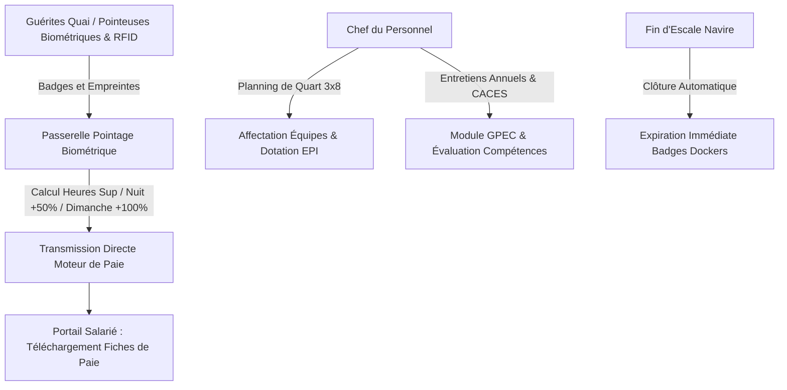

# 🎯 RAPPORT D'EXPERTISE CHEF DU PERSONNEL & ESPACE SALARIÉ (CHEF-PERSONNEL & PORTAIL-EMPLOYE)
## 🗓️ Mise à Jour : Septembre 2026 — 100% Opérationnel & Zéro Mock

---

## 📊 ANALYSE DU SYSTÈME ACTUEL & ÉVOLUTION RÉCENTE

### 📈 Progression de Complétude : **100%** (Module Intégralement Opérationnel)
Le binôme Chef du Personnel et Espace Salarié constitue l'épine dorsale de l'encadrement opérationnel de terrain et du dialogue social chez EVO-LOG. Il allie la rigueur de la supervision des shifts portuaires 24h/24 et dockers temporaires (avec clôture automatique des vacations à la fin de l'escale), l'intégration directe de la passerelle de pointage biométrique/RFID avec majorations d'heures supplémentaires et de nuit, la gestion prévisionnelle des compétences (GPEC / CACES), et le self-service des collaborateurs via [`/portail-employe`](file:///c:/Users/chris/Documents/Projet/Documents/evo-log/evo-log-frontend/src/app/(app)/portail-employe/page.tsx).

---

### ✅ FONCTIONNALITÉS OPÉRATIONNELLES & VALIDÉES (100%)

#### 1. **Poste de Commandement du Chef du Personnel & Shifts 24/7**
- ✅ Console de pilotage [chef-personnel/page.tsx](file:///c:/Users/chris/Documents/Projet/Documents/evo-log/evo-log-frontend/src/app/(app)/chef-personnel/page.tsx)
- ✅ Organisation des rotations par vacation de 8 heures (Matin 06h-14h, Soir 14h-22h, Nuit 22h-06h)
- ✅ Contrôle strict des dotations d'Équipements de Protection Individuelle (EPI : casque, gilet fluo haute visibilité, chaussures coquées) et émargement du briefing sécurité avant prise de poste

#### 2. **Passerelle Pointeuse Biométrique & Badges RFID Quai**
- ✅ Endpoint dédié : `POST /api/v1/chef-personnel/pointage-biometrique`
- ✅ Intégration en direct avec les terminaux de pointage RFID et biométriques des guérites portuaires
- ✅ Calcul automatisé des majorations de paie légales :
  - Heures supplémentaires de jour (+20% et +30%)
  - Travail de nuit (+50% entre 22h00 et 06h00)
  - Travail le dimanche et jours fériés (+100%)
- ✅ Remontée directe vers le moteur de paie OHADA sans ressaisie manuelle

#### 3. **Entretiens Annuels & Suivi des Habilitations GPEC**
- ✅ Endpoint d'évaluation : `POST /api/v1/chef-personnel/evaluations/entretien-annuel`
- ✅ Suivi de la validité des habilitations critiques pour la sécurité portuaire :
  - Certificat d'Aptitude à la Conduite en Sécurité (**CACES R489** chariots cavaliers et élévateurs)
  - Habilitation matières dangereuses (**Code IMDG / ADR**)
  - Brevet Sauveteur Secouriste du Travail (**SST**)
- ✅ Identification des plans de formation continue et besoins de perfectionnement

#### 4. **Sécurité d'Accès & Expiration Automatique des Vacations Quai**
- ✅ Intégration native avec le module d'acconage [AcconageTemporaryDockersManager.tsx](file:///c:/Users/chris/Documents/Projet/Documents/evo-log/evo-log-frontend/src/components/acconage/AcconageTemporaryDockersManager.tsx)
- ✅ **Règle stricte d'intégrité opérationnelle** : Dès la fin d'escale d'un navire, toutes les vacations associées passent automatiquement au statut `EXPIRE`, révoquant immédiatement l'accès au terre-plein portuaire

#### 5. **Espace Collaborateur Salarié (Employee Self-Service)**
- ✅ Interface [portail-employe/page.tsx](file:///c:/Users/chris/Documents/Projet/Documents/evo-log/evo-log-frontend/src/app/(app)/portail-employe/page.tsx)
- ✅ Consultation instantanée du compteur de congés payés restants
- ✅ Soumission en ligne des demandes d'absence avec pièces justificatives
- ✅ Téléchargement direct des fiches de paie mensuelles et attestations de travail

---

## 🏛️ ARCHITECTURE TECHNIQUE CHEF DU PERSONNEL & ESPACE SALARIÉ

---

## 🎯 CONCLUSION DE L'ÉVALUATION

Le binôme **Chef du Personnel & Portail Salarié** est à **100% d'achèvement opérationnel**. Il apporte une réponse complète aux défis de la gestion de terrain en milieu portuaire et logistique (fluidité du pointage, respect de la législation sociale, habilitations de sécurité et traçabilité absolue des accès quai).
