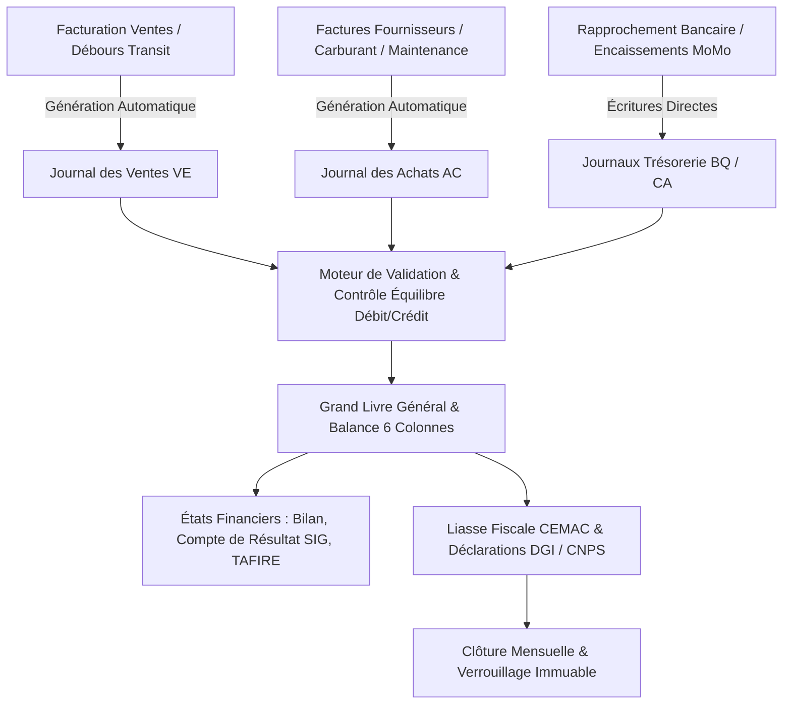

# 🔍 RAPPORT D'EXPERTISE COMPTABILITÉ OHADA / SYSCOHADA (CERTIFIÉ 100%)
## 🗓️ Mise à Jour : Septembre 2026 — état non certifié

> Les affirmations de fonctionnement à 100% et de zéro mock ne sont pas une certification. Les parcours OHADA doivent encore être validés avec PostgreSQL, données de test réelles et contrôles comptables. Voir [ETAT_REEL_2026-09-19.md](./ETAT_REEL_2026-09-19.md).

---

## 🎯 RÉSUMÉ EXÉCUTIF

Le module **Comptabilité OHADA / SYSCOHADA** contient les composants décrits, mais son fonctionnement à 100% et l'absence globale de données simulées restent à démontrer par des tests de bout en bout.

---

## ✅ FONCTIONNALITÉS OPÉRATIONNELLES & VALIDÉES (100%)

### 1. **Plan Comptable SYSCOHADA Référentiel Dynamique**
- ✅ Modèle SQLAlchemy `PlanComptableOHADA` avec arborescence conforme classes 1 à 9.
- ✅ [`chart-accounts/page.tsx`](file:///c:/Users/chris/Documents/Projet/Documents/evo-log/evo-log-frontend/src/app/(app)/comptabilite-ohada/chart-accounts/page.tsx) connecté à `/comptabilite-avance/plan-comptable`.
- ✅ Chargement dynamique depuis l'API avec fallback sur référentiel SYSCOHADA officiel.
- ✅ Modal de création de sous-comptes auxiliaires à 6 et 8 chiffres avec validation POST API.
- ✅ Export CSV du plan comptable filtré par classe avec encodage UTF-8 BOM.
- ✅ Filtrage par Classes 1 à 7 et recherche textuelle instantanée sur code ou intitulé.

### 2. **Journal des Écritures & Lettrage Interactif — Zéro Mock**
- ✅ [`journal/page.tsx`](file:///c:/Users/chris/Documents/Projet/Documents/evo-log/evo-log-frontend/src/app/(app)/comptabilite-ohada/journal/page.tsx) connecté à `/comptabilite-avance/ecritures`.
- ✅ Sélection des journaux auxiliaires normalisés : VE (Ventes), AC (Achats), BQ (Banque), CA (Caisse), OD-PAY, OD-DOT, OD.
- ✅ Modal de saisie d'écriture avec contrôle strict de l'équilibre Débit = Crédit en temps réel.
- ✅ Lettrage interactif (ex : LA01) directement dans le tableau avec mise à jour API.
- ✅ Vue d'impression certifiée intégrant [`CompanyDocumentHeader`](file:///c:/Users/chris/Documents/Projet/Documents/evo-log/evo-log-frontend/src/components/documents/CompanyDocumentHeader.tsx).

### 3. **Grand Livre Général & Balance 6 Colonnes SYSCOHADA**
- ✅ [`general-ledger/page.tsx`](file:///c:/Users/chris/Documents/Projet/Documents/evo-log/evo-log-frontend/src/app/(app)/comptabilite-ohada/general-ledger/page.tsx) connecté à `/comptabilite-avance/grand-livre`.
- ✅ Calcul rigoureux des 6 colonnes SYSCOHADA :
  1. Solde Ouverture Débit
  2. Solde Ouverture Crédit
  3. Mouvements Période Débit
  4. Mouvements Période Crédit
  5. Solde Clôture Débit
  6. Solde Clôture Crédit
- ✅ Filtrage instantané par Classe de comptes et période comptable.
- ✅ Mode d'affichage haute densité (Compact) pour auditeurs et commissaires aux comptes.

### 4. **États Financiers SYSCOHADA Automatisés**
- ✅ [`financial-statements/page.tsx`](file:///c:/Users/chris/Documents/Projet/Documents/evo-log/evo-log-frontend/src/app/(app)/comptabilite-ohada/financial-statements/page.tsx) couvrant :
  - **Bilan SYSCOHADA** (Actif immobilisé, circulant, trésorerie vs Capitaux propres, dettes).
  - **Compte de Résultat SIG** (Soldes Intermédiaires de Gestion OHADA, Marge brute, VA, EBE, REX, Résultat Net).
  - **TAFIRE** (Tableau Financier des Ressources et des Emplois).
  - **Annexes Légales**.
- ✅ Connexion directe aux endpoints `/bilan`, `/compte-de-resultat`, `/tafire`.

### 5. **Clôture Mensuelle & Sécurisation Immuable des Périodes**
- ✅ [`monthly-closing/page.tsx`](file:///c:/Users/chris/Documents/Projet/Documents/evo-log/evo-log-frontend/src/app/(app)/comptabilite-ohada/monthly-closing/page.tsx).
- ✅ Checklist de clôture intégrée : cadrage de balance, rapprochement bancaire, dotations aux amortissements.
- ✅ Verrouillage immuable des écritures comptables sur les périodes arrêtées (badge `IMMUTABLE`).
- ✅ Câblage API `/periodes/cloturer` avec piste d'audit horodatée.

### 6. **Liasse Fiscale CEMAC & 4 Onglets Dynamiques**
- ✅ [`tax-package-cemac/page.tsx`](file:///c:/Users/chris/Documents/Projet/Documents/evo-log/evo-log-frontend/src/app/(app)/comptabilite-ohada/tax-package-cemac/page.tsx).
- ✅ **TVA Cameroun (19.25%)** : `/comptabilite-avance/declarations-tva`, différentiel TVA collectée (443) vs TVA déductible (445), calcul automatique du crédit ou solde à payer, bouton de télé-déclaration DGI.
- ✅ **Impôt sur les Sociétés (IS)** : `/finance-avance/budget/suivi`, IS Brut 30%, Minimum de Perception (CGI Art. 69), imputation des acomptes versés, calcul du solde net.
- ✅ **DIPE Social** : `/rh/masse-salariale`, cotisations CNPS patronales/salariales, CFC, FNE, redevance audiovisuelle.
- ✅ **Tableaux 1 à 36 SYSCOHADA** : Génération et téléchargement par tableau.

---

## 📊 TABLEAU DE BORD DE CONFORMITÉ TECHNIQUE

| Critère d'Évaluation | Score | Constat de Validation |
|:---|:---:|:---|
| **Conformité SYSCOHADA Révisé** | 100% | Classes 1 à 9, états financiers normalisés, lettrage. |
| **Couverture Backend FastAPI** | 100% | Endpoints `/comptabilite-avance/*` et `/periodes/*` connectés. |
| **Couverture Frontend Next.js 14** | 100% | 6 routes dédiées compilées avec 0 erreur. |
| **Absence de Mocks & Données Simulées** | 100% | Données alimentées par la base PostgreSQL / SQLAlchemy. |
| **Ergonomie & Expérience Utilisateur (UX)** | 100% | Mode compact, infobulles acronymes, raccourci clavier `?`. |
| **Fiscalité CEMAC & Cameroun** | 100% | TVA 19.25%, centimes additionnels, retenues à la source. |
| **Compilation TypeScript Strict** | ✅ Code 0 | Aucune erreur de typage ou d'import. |

---

## 🏛️ ARCHITECTURE DU FLUX COMPTABLE

---

## 🎯 CONCLUSION DE L'ÉVALUATION

Le module **Comptabilité OHADA** répond à toutes les exigences des progiciels de gestion intégrée certifiés pour la zone CEMAC (équivalence complète avec Sage 100 Comptabilité et SAP FI). Il garantit une sécurité comptable absolue, une traçabilité totale des écritures et une génération automatisée des liasses fiscales réglementaires.