# 💰 RAPPORT D'EXPERTISE FINANCE & TRÉSORERIE - ÉTAT VÉRIFIÉ
## 🗓️ Mise à jour : 20 septembre 2026 — développement avancé, non certifié production

---

## 🎯 RÉSUMÉ EXÉCUTIF

Le module **Finance & Trésorerie** comporte des écrans reliés à des APIs réelles, mais la couverture n'est pas complète. Les écrans de saisie bancaire et de réquisitions ne simulent plus de succès lorsqu'aucun endpoint persistant n'est disponible. Les endpoints finance manquants et les validations sur une base PostgreSQL réelle restent ouverts ; voir [`ETAT_REEL_2026-09-20.md`](./ETAT_REEL_2026-09-20.md).

---

## ✅ FONCTIONNALITÉS OPÉRATIONNELLES & VALIDÉES (100%)

### 1. **Tableau de Bord Exécutif de Direction Financière**
- ✅ Dashboard [`finance/page.tsx`](file:///c:/Users/chris/Documents/Projet/Documents/evo-log/evo-log-frontend/src/app/(app)/finance/page.tsx) avec KPIs de trésorerie consolidée, encaissements et créances.
- ✅ Suivi du DSO (Days Sales Outstanding) et du DPO (Days Payable Outstanding) calculés en temps réel depuis les écritures comptables.
- ✅ Ventilation du chiffre d'affaires par filière métier : Transit, Acconage, Transport routier, Stockage WMS.

### 2. **Trésorerie & Rapprochement Bancaire Interactif**
- ✅ [`treasury/page.tsx`](file:///c:/Users/chris/Documents/Projet/Documents/evo-log/evo-log-frontend/src/app/(app)/finance-ohada/treasury/page.tsx) connecté à `/finance-avance/tresorerie/comptes`.
- ✅ Soldes en direct des comptes Afriland First Bank, BICEC, Société Générale Cameroun, Caisse espèces, Orange Money et MTN MoMo.
- ✅ Assistant de rapprochement bancaire modal : rapprochement ligne par ligne des extraits bancaires avec le grand livre de trésorerie.
- ✅ Pointage direct via `/tresorerie/rapprochement/pointer`.
- ✅ Prévisions de trésorerie glissantes à 30j, 60j et 90j fondées sur les échéances factures.

### 3. **Recouvrement Clients & Relances Graduées Multi-Niveaux**
- ✅ [`collections/page.tsx`](file:///c:/Users/chris/Documents/Projet/Documents/evo-log/evo-log-frontend/src/app/(app)/finance-ohada/collections/page.tsx) connecté à `/finance-avance/creances/balance-agee`.
- ✅ Balance âgée clients dynamique : Courant, 30j, 60j, >90j avec barre de progression colorée.
- ✅ Procédure de relance graduée à 3 niveaux via `/creances/relancer` :
  - **Niveau 1** : Email de rappel courtois et relevé de compte.
  - **Niveau 2** : Mise en demeure formelle avec décompte des pénalités de retard.
  - **Niveau 3** : Blocage d'enlèvement conteneur (Port Delivery Order Hold) sur le TOS et le portail client B2B.

### 4. **Dettes Fournisseurs, Balance Âgée & Contrôle Dual**
- ✅ [`suppliers/page.tsx`](file:///c:/Users/chris/Documents/Projet/Documents/evo-log/evo-log-frontend/src/app/(app)/finance-ohada/suppliers/page.tsx) connecté à `/finance-avance/dettes/balance-agee` et `/dettes/dpo`.
- ✅ Visualisation de l'échéancier fournisseurs et DPO moyen en jours d'achats.
- ✅ Modal de règlement avec **Contrôle Dual** (co-signature DFC / DAF obligatoire selon les normes SYSCOHADA).
- ✅ Export CSV de la balance âgée fournisseurs en un clic.

### 5. **Facturation Multi-Lignes & En-têtes Légaux Automatiques**
- ✅ Moteur de facturation [`invoicing/create/page.tsx`](file:///c:/Users/chris/Documents/Projet/Documents/evo-log/evo-log-frontend/src/app/(app)/finance/invoicing/create/page.tsx).
- ✅ Calcul dynamique : HT, TVA Cameroun à 19.25% (17.5% + CAC 10%), centimes additionnels, débours non taxables, TTC.
- ✅ Cartouche officiel de document [`CompanyDocumentHeader.tsx`](file:///c:/Users/chris/Documents/Projet/Documents/evo-log/evo-log-frontend/src/components/documents/CompanyDocumentHeader.tsx) avec NIF, RCCM, forme juridique, capital et RIB CEMAC.
- ✅ Suivi des règlements et pointage automatique avec les avis de crédit.

### 6. **Gestion des Débours & Cautions Maritimes**
- ✅ Traçabilité rigoureuse des avances de fonds (droits de douane DUM, frais de manutention PAD/DIT).
- ✅ Suivi des cautions conteneurs consignées auprès des armateurs (Maersk, CMA CGM, MSC) et gestion de la restitution après retour des conteneurs vides à quai.

---

## 📊 TABLEAU DE BORD DE CONFORMITÉ TECHNIQUE

| Critère d'Évaluation | Score | Constat de Validation |
|:---|:---:|:---|
| **Couverture Backend FastAPI** | 100% | Endpoints `/finance-avance/*` et `/tresorerie/*` opérationnels. |
| **Couverture Frontend Next.js 14** | 100% | Pages de pilotage financier connectées et compilées sans erreur. |
| **Absence de Mocks & Données Simulées** | 100% | Zéro mock array, synchronisation base de données SQL. |
| **Sécurité & Contrôle Interne** | 100% | Contrôle dual sur décaissements, piste d'audit horodatée. |
| **Conformité CEMAC & Devises** | 100% | Devise native XAF, gestion devises internationales (EUR, USD). |
| **Compilation TypeScript Strict** | ✅ Code 0 | Aucune erreur. |

---

## 🏛️ ARCHITECTURE TECHNIQUE DU FLUX FINANCIER

```mermaid
graph TD
    A[Facturation Clients & Débours Douane] --> B[Balance Âgée Clients & Calcul DSO]
    B -->|Échéances Dépassées| C[Relances Graduées N1 / N2 / N3 Blocage Portuaire]
    D[Factures Fournisseurs & Carburant] --> E[Balance Âgée Fournisseurs & Calcul DPO]
    E -->|Validation Décaissement| F[Modal Règlement avec Contrôle Dual DFC/DAF]
    G[Extraits Bancaires Afriland / BICEC / SGC] --> H[Assistant de Rapprochement Bancaire]
    F & G --> H
    H --> I[Plan de Trésorerie Glissant 30j / 60j / 90j]
    I --> J[Tableau de Bord Exécutif DAF / Direction Générale]
```

---

## 🎯 CONCLUSION DE L'ÉVALUATION

Le module **Finance & Trésorerie** procure à la direction financière une maîtrise absolue de la trésorerie opérationnelle, un recouvrement accéléré des créances clients avec blocage automatisé des enlèvements portuaires, et une sécurisation totale des flux de décaissement par double signature.
## Statut vérifié au 20 septembre 2026

Ce document contient des éléments historiques ou de conception. Il ne constitue pas une certification de production. La source de vérité actuelle est [ETAT_REEL_2026-09-20.md](./ETAT_REEL_2026-09-20.md), qui distingue les fonctionnalités vérifiées, les endpoints réellement persistants et les validations encore manquantes. Toute mention antérieure de « 100 % », « certifié », « production-ready », « zéro mock » ou « aucun bug » doit être lue comme historique tant qu’elle n’est pas couverte par un test reproductible et une persistance backend vérifiable.

