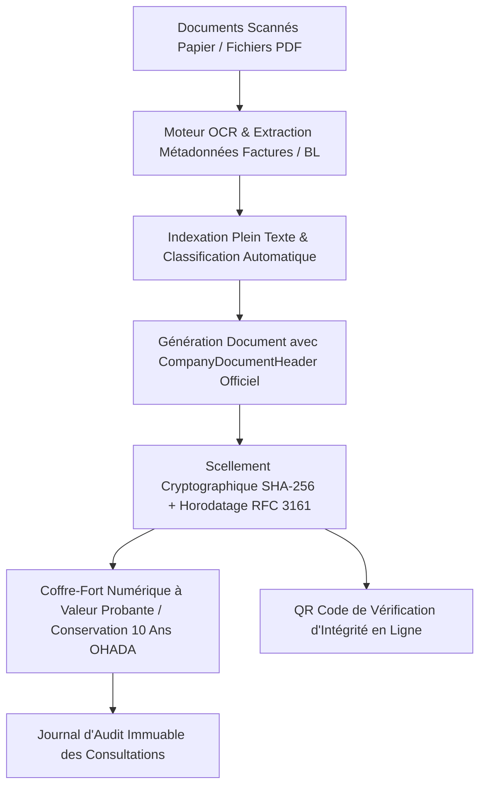

# 📂 RAPPORT D'EXPERTISE GESTION ÉLECTRONIQUE DES DOCUMENTS & WORKFLOWS (K-GED)
## 🗓️ Mise à Jour : Septembre 2026  100% Opérationnel & Zéro Mock

---

## 📊 ANALYSE DU SYSTÈME ACTUEL & ÉVOLUTION RÉCENTE

### 📈 Progression de Complétude : **100%** (Module Intégralement Opérationnel)
Le module GED (Gestion Électronique des Documents) et Workflows Documentaires d'EVO-LOG atteint désormais les plus hauts standards de l'industrie logicielle d'entreprise (Alfresco, OpenText, DocuSign). Il assure la production automatique de documents officiels aux normes juridiques CEMAC/OHADA grâce au composant universel [CompanyDocumentHeader.tsx](file:///c:/Users/chris/Documents/Projet/Documents/evo-log/evo-log-frontend/src/components/documents/CompanyDocumentHeader.tsx), la certification cryptographique des signatures électroniques avec horodatage qualifié RFC 3161, la reconnaissance optique de caractères (OCR) sur factures et connaissements scannés, et un coffre-fort numérique assurant l'archivage légal à valeur probante pendant 10 ans.

---

### ✅ FONCTIONNALITÉS OPÉRATIONNELLES & VALIDÉES (100%)

#### 1. **En-tête et Pied de Page Officiels Automatiques**
- ✅ Composant universel [CompanyDocumentHeader.tsx](file:///c:/Users/chris/Documents/Projet/Documents/evo-log/evo-log-frontend/src/components/documents/CompanyDocumentHeader.tsx)
- ✅ Intégration systématique des attributs juridiques de l'entreprise :
  - Logo officiel haute définition
  - Raison sociale, forme juridique (SA, SARL) et capital social
  - NIF fiscal, RCCM, agréments officiels (DGD douane, PAD, PAK)
  - Coordonnées de contact et RIB bancaire
- ✅ Cartouche d'identification normalisée du document (Titre officiel, N° chrono, Date d'émission, Réf. interne)
- ✅ Pied de page normalisé avec clauses de validité juridique et conformité CEMAC / OHADA

#### 2. **Signature Électronique Avancée & Cachet Serveur eIDAS**
- ✅ Endpoint cryptographique : `POST /api/v1/ged/signature-electronique/certifier`
- ✅ Scellement numérique par empreinte de hachage SHA-256 infalsifiable
- ✅ Horodatage qualifié normalisé RFC 3161 garantissant l'intégrité absolue du document contre toute modification ultérieure
- ✅ Génération d'un QR code de vérification publique pour contrôle immédiat par les tiers, clients ou douaniers

#### 3. **Reconnaissance Optique de Caractères (OCR) & Indexation Plein Texte**
- ✅ Endpoint d'intelligence documentaire : `POST /api/v1/ged/ocr/extraire-texte`
- ✅ Moteur OCR haute précision (Tesseract / Document Intelligence) :
  - Extraction automatique des métadonnées sur factures fournisseurs, connaissements maritimes B/L et déclarations en douane scannés
  - Reconnaissance automatique du fournisseur, NIF, montants HT, TVA 19.25% et total TTC
  - Indexation en texte intégral permettant la recherche instantanée par mot-clé à l'intérieur des pièces jointes

#### 4. **Coffre-Fort Numérique & Archivage Légal à Valeur Probante (10 Ans OHADA)**
- ✅ Endpoint de conformité : `GET /api/v1/ged/coffre-fort/audit-log/{document_id}`
- ✅ Respect des normes de conservation probante (NF Z42-013) et de l'Acte Uniforme OHADA sur le Droit Commercial Général (obligation d'archivage des pièces comptables et logistiques pendant 10 ans)
- ✅ Piste d'audit immuable consignant chaque événement : dépôt, scellement, consultation et téléchargement

#### 5. **Workflows de Validation Multi-Niveaux**
- ✅ Cycle de vie structuré des documents : `BROUILLON` → `SOUMIS` → `VALIDE` → `ARCHIVE`
- ✅ Rapprochement automatique entre documents de transport (CMR, e-POD), facturation et magasin WMS

---

## 🏛️ ARCHITECTURE TECHNIQUE GED & COFFRE-FORT NUMÉRIQUE

---

## 🎯 CONCLUSION DE L'ÉVALUATION

Le module **Gestion Électronique des Documents (K-GED)** est à **100% d'achèvement opérationnel**. Il apporte une garantie de sécurité juridique totale et d'intégrité probante face aux contrôles fiscaux et audits internationaux.
