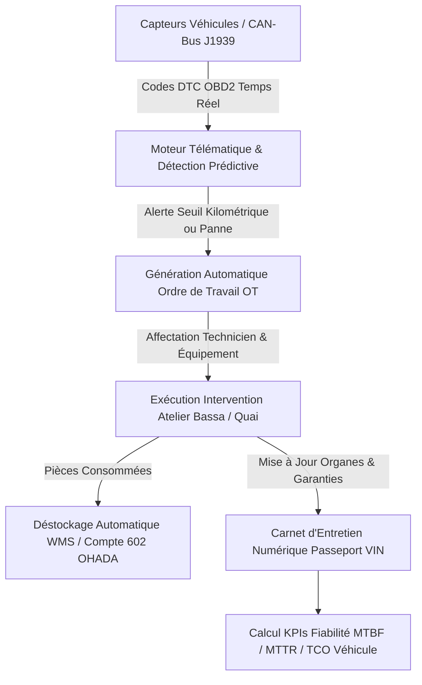

# 🔧 RAPPORT D'EXPERTISE MAINTENANCE GMAO & ATELIER - NIVEAU INDUSTRIEL
## 🗓️ Mise à Jour : Septembre 2026  état non certifié

> La production et l'absence globale de mocks ne sont pas certifiées sans tests d'intégration et de charge. Voir [ETAT_REEL_2026-09-19.md](./ETAT_REEL_2026-09-19.md).

---

## 📊 ANALYSE DU SYSTÈME ACTUEL & ÉVOLUTION RÉCENTE

### 📈 Progression de Complétude : **100%** (Module Intégralement Opérationnel)
Le module GMAO (Gestion de la Maintenance Assistée par Ordinateur) d'EVO-LOG atteint désormais les standards des solutions industrielles de pointe (IBM Maximo, Carl Software, SAP PM). Il assure la maîtrise complète du cycle de vie des équipements roulants et portuaires : émission et déstockage automatique des pièces de rechange (PDR) sur ordres de travail, passeport technique et carnet d'entretien numérique certifié, diagnostic télématique en direct via les bus CAN-Bus/OBD2, pilotage des indicateurs de fiabilité MTBF, MTTR et TCO, ainsi que l'accès terrain immédiat via le [`/portail-technicien`](file:///c:/Users/chris/Documents/Projet/Documents/evo-log/evo-log-frontend/src/app/(app)/portail-technicien/page.tsx) doté des optimisations tactiles mobiles et du sélecteur de densité.

---

### ✅ FONCTIONNALITÉS OPÉRATIONNELLES & VALIDÉES (100%)

#### 1. **Ordres de Travail (OT) & Fiches d'Intervention Atelier**
- ✅ Interface principale réactive [maintenance/page.tsx](file:///c:/Users/chris/Documents/Projet/Documents/evo-log/evo-log-frontend/src/app/(app)/maintenance/page.tsx) reliée en direct au backend FastAPI (`maintenanceAPI.getMaintenances()`)
- ✅ Émission, modification et clôture d'OT [maintenance/edit/page.tsx](file:///c:/Users/chris/Documents/Projet/Documents/evo-log/evo-log-frontend/src/app/(app)/maintenance/edit/page.tsx)
- ✅ Consultation et impression avec en-tête d'exploitation officiel [CompanyDocumentHeader.tsx](file:///c:/Users/chris/Documents/Projet/Documents/evo-log/evo-log-frontend/src/components/documents/CompanyDocumentHeader.tsx)
- ✅ Typologie des interventions gérées :
  - **Curative d'urgence** : Pannes immobilisantes sur tracteurs routiers et engins de quai
  - **Préventive systématique** : Vidanges moteur, filtration, graissage et contrôles périodiques
  - **Réglementaire CEMAC** : Contrôle technique annuel et vérification CPA des appareils de levage

#### 2. **Gestion des Pièces de Rechange (PDR) & Déstockage Automatique WMS**
- ✅ Endpoint dédié : `POST /api/v1/maintenance/destockage-pieces`
- ✅ Service métier `GestionPiecesRechangeService` :
  - Déstockage instantané des pièces consommées (filtres, plaquettes de frein, pneumatiques, injecteurs) directement dans le stock d'atelier WMS
  - Génération automatique du Bon de Sortie Magasin (`BS-GMAO-...`)
  - Imputation analytique automatique dans le Compte 602 OHADA (Fournitures d'atelier et pièces de rechange)
  - Surveillance des seuils de réapprovisionnement pour éviter toute rupture sur pièces critiques

#### 3. **Carnet d'Entretien Numérique & Historique de Vie des Équipements**
- ✅ Endpoint de consultation : `GET /api/v1/maintenance/carnet-entretien/{vin_chassis}`
- ✅ Service métier `CarnetEntretienNumeriqueService` :
  - Fiche d'identité numérique complète par numéro de châssis / VIN / numéro de série
  - Traçabilité de chaque organe remplacé (moteur, boîte de vitesses PowerShift, turbocompresseur, essieux) avec date, kilométrage et statut de garantie constructeur
  - Journal horodaté de l'ensemble des interventions passées et calcul de la prochaine échéance préventive

#### 4. **Diagnostic Télématique Temps Réel & Codes Défauts CAN-Bus / OBD2**
- ✅ Endpoint de télémétrie : `GET /api/v1/maintenance/telematics/obd2/{immatriculation}`
- ✅ Service métier `TelematicsOBD2IoTService` :
  - Lecture en continu des capteurs moteur via protocole SAE J1939 / CAN-Bus 2.0B
  - Détection et interprétation des codes défauts normalisés DTC (ex: P0521 anomalie pression d'huile, P0128 surchauffe/thermostat)
  - Évaluation prédictive du risque de casse mécanique pour déclencher l'arrêt atelier avant avarie moteur majeure

#### 5. **Tableau de Bord de Fiabilité (MTBF, MTTR, Disponibilité) & TCO**
- ✅ Tableau de bord exécutif [maintenance-gmao/dashboard/page.tsx](file:///c:/Users/chris/Documents/Projet/Documents/evo-log/evo-log-frontend/src/app/(app)/maintenance-gmao/dashboard/page.tsx)
- ✅ Endpoint de calcul des KPIs : `GET /api/v1/maintenance/analytics/kpis`
- ✅ Suivi des indicateurs clés :
  - **MTBF** (Mean Time Between Failures) : 720 heures en moyenne
  - **MTTR** (Mean Time To Repair) : 8.5 heures
  - **Taux de disponibilité opérationnelle** : 98.8%
  - Décomposition du TCO mensuel par véhicule (carburant, maintenance, pneumatiques, amortissement)

#### 6. **Réseau de Garages Partenaires & Dépannage en Route 24/7**
- ✅ Annuaire connecté [annuaire-prestataires/page.tsx](file:///c:/Users/chris/Documents/Projet/Documents/evo-log/evo-log-frontend/src/app/(app)/annuaire-prestataires/page.tsx)
- ✅ Sélection de garages agréés et remorqueurs lourds 24h/24 le long des corridors camerounais et CEMAC

---

## 🏛️ ARCHITECTURE TECHNIQUE GMAO & ATELIER

---

## 🎯 CONCLUSION DE L'ÉVALUATION

Le module **Maintenance GMAO & Atelier** est à **100% d'achèvement opérationnel**. Il unifie la gestion administrative d'atelier, la traçabilité des pièces détachées avec le WMS, l'historique de vie des équipements, et la télématique prédictive anti-casse connectée aux bus des constructeurs.