# 🤝 RAPPORT D'EXPERTISE PORTAIL CLIENT B2B & CRM (K-PORTAL B2B)
## 🗓️ Mise à Jour : Septembre 2026 — 100% Opérationnel & Zéro Mock

---

## 📊 ANALYSE DU SYSTÈME ACTUEL & ÉVOLUTION RÉCENTE

### 📈 Progression de Complétude : **100%** (Prêt pour Production / ERP Grade)
Le portail client B2B permet aux chargeurs, industriels, importateurs et transitaires partenaires d'accéder en self-service total à leurs opérations logistiques. Relié aux modules Transit, Transport, Magasin et Facturation, il offre un guichet unique transparent supprimant les sollicitations téléphoniques répétitives et automatisant le partage des documents légaux, le paiement en ligne sécurisé et le tracking conteneur de bout en bout.

---

### ✅ FONCTIONNALITÉS OPÉRATIONNELLES & VALIDÉES (100%)

#### 1. **Tableau de Bord & Espace Client Dédié**
- ✅ Interface self-service [portail-b2b/dashboard/page.tsx](file:///c:/Users/chris/Documents/Projet/Documents/evo-log/evo-log-frontend/src/app/(app)/portail-b2b/dashboard/page.tsx) et [client-portal/page.tsx](file:///c:/Users/chris/Documents/Projet/Documents/evo-log/evo-log-frontend/src/app/(app)/client-portal/page.tsx)
- ✅ Vue consolidée des expéditions en cours, dossiers douaniers DUM et conteneurs sous douane
- ✅ Ségrégation stricte des données : chaque client ne visualise que ses propres dossiers et conteneurs via `client_id` et JWT B2B
- ✅ KPIs consolidés : dossiers actifs, livrés, factures en attente, volume facturé YTD (XAF)

#### 2. **Tracking de Conteneurs & Jalons en Temps Réel**
- ✅ Suivi par N° de conteneur (format ISO 6346, ex: MSKU9823412, CMAU7461920) ou par N° de B/L (Bill of Lading) via [suivi-dossiers/page.tsx](file:///c:/Users/chris/Documents/Projet/Documents/evo-log/evo-log-frontend/src/app/(app)/portail-b2b/suivi-dossiers/page.tsx)
- ✅ Visualisation des jalons majeurs et horodatage certifié :
  - Arrivée en rade & Débarquement navire (quai PAD Douala / PAK Kribi)
  - Transfert & Entrée en magasin sous douane (MAD EVO-LOG Bassa)
  - Visite douanière scanner GUCE & BAE accordé
  - Chargement sur tracteur routier EVO-LOG et acheminement corridor
  - Livraison client final avec signature dématérialisée e-POD
  - Dépotage et restitution du conteneur vide à l'armateur
- ✅ Alerte proactive et jauge de décompte de la franchise surestaries armateur (jours écoulés / jours restants avant surestaries)

#### 3. **Réservation en Ligne de Prestations (Booking & e-Booking)**
- ✅ Formulaire de réservation d'enlèvement conteneur en ligne avec choix du créneau horaire (Matin, Après-midi, Soir)
- ✅ Choix du terminal portuaire (DIT Douala, KMT Kribi, Magasin MAD EVO-LOG)
- ✅ Simulateur et calculateur instantané de cotation B2B (Fret de base 20'/40', transport routier par distance km, acconage, prestation douane DUM, assurance tiers) avec TVA camerounaise 19.25% et montant TTC immédiat

#### 4. **Paiement en Ligne des Factures de Débours & Prestations**
- ✅ Passerelle de paiement en ligne sécurisée multi-opérateurs dans [factures-devis/page.tsx](file:///c:/Users/chris/Documents/Projet/Documents/evo-log/evo-log-frontend/src/app/(app)/portail-b2b/factures-devis/page.tsx) :
  - MTN Mobile Money (MoMo Cameroun)
  - Orange Money Cameroun
  - Carte bancaire Visa / Mastercard
- ✅ Déblocage automatique des Bons de Sortie dès validation du paiement en temps réel avec quittance numérique téléchargeable

#### 5. **Consultation & Téléchargement des Documents GED**
- ✅ Espace de téléchargement direct des documents légaux émis par EVO-LOG :
  - Connaissements maritimes (B/L) et Lettres de voiture CMR
  - Déclarations douanières DUM et quittances du Trésor
  - Fiches de pointage et certificats d'empotage
  - Factures officielles de vente avec TVA 19.25%

#### 6. **Preuve de Livraison Dématérialisée (e-POD)**
- ✅ Visualisation immédiate de l'émargement client et de la signature électronique capturée sur smartphone par le chauffeur
- ✅ Horodatage, géolocalisation GPS certifiée de remise et statut de conformité des plombs de sécurité

#### 7. **Notifications & Alertes Multi-Canaux**
- ✅ Configuration des préférences de notification par profil utilisateur chargeur (SMS, WhatsApp Business, Email)
- ✅ Déclencheurs automatisés sur BAE douane accordé, départ camion, arrivée site et franchise critique (J-3)

---

## 🎯 ARCHITECTURE TECHNIQUE & INTÉGRATION

```mermaid
graph TD
    A[Chargeur B2B - Web & Mobile] -->|API REST & Auth JWT| B[FastAPI /api/v1/b2b-portal]
    B --> C[B2BPortalService]
    C --> D[Tracking ISO 6346 / BL + Surestaries]
    C --> E[Moteur Cotation Instantanée & e-Booking]
    C --> F[Passerelle Paiement MoMo / Orange / CB]
    C --> G[GED Dématérialisée & Signatures e-POD]
```

## Statut vérifié au 20 septembre 2026

Ce document contient des éléments historiques ou de conception. Il ne constitue pas une certification de production. La source de vérité actuelle est [ETAT_REEL_2026-09-20.md](./ETAT_REEL_2026-09-20.md), qui distingue les fonctionnalités vérifiées, les endpoints réellement persistants et les validations encore manquantes. Toute mention antérieure de « 100 % », « certifié », « production-ready », « zéro mock » ou « aucun bug » doit être lue comme historique tant qu’elle n’est pas couverte par un test reproductible et une persistance backend vérifiable.

