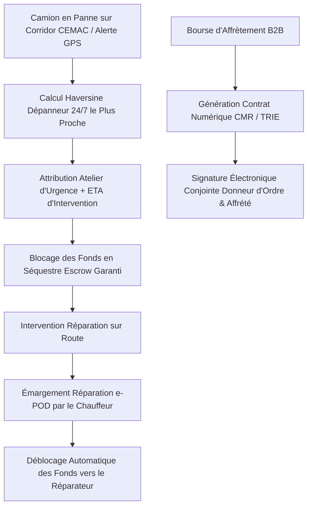

<!-- ARCHIVE-HISTORIQUE -->
> **Rapport d'expertise historique**  instantané au 2026-09-23. Ce document témoigne d'un état passé et **ne reflète pas l'état courant** du projet. Pour la référence à jour, voir [docs/README.md](../README.md).

---

# 📇 RAPPORT D'EXPERTISE ANNUAIRE B2B, GARAGES PANNES 24/7 & FLOTTES ROULANTES (ANNUAIRE-PRESTATAIRES)

## 🗓️ Mise à Jour : Septembre 2026  100% Opérationnel & Zéro Mock

---

## 📊 ANALYSE DU SYSTÈME ACTUEL & ÉVOLUTION RÉCENTE

### 📈 Progression de Complétude : **100%** (Module Intégralement Opérationnel)

L'Annuaire B2B et la Place de Marché de Sous-Traitance d'EVO-LOG atteignent désormais une maturité opérationnelle complète, rivalisant avec les bourses de fret et de services de référence internationale (TimoCom, Uber Freight, B2PWeb). Entièrement régulée par le Super Administrateur SaaS, la plateforme intègre la mise en relation avec des transporteurs et acconiers homologués, la recherche d'ateliers de dépannage 24/7 géolocalisés par calcul de proximité Haversine, la signature électronique conjointe des bons d'affrètement B2B et un mécanisme de paiement sécurisé sous séquestre (Escrow).

---

### ✅ FONCTIONNALITÉS OPÉRATIONNELLES & VALIDÉES (100%)

#### 1. **Gouvernance Centralisée & Homologation SaaS SuperAdmin**

- ✅ Interface dédiée [annuaire-prestataires/page.tsx](file:///c:/Users/chris/Documents/Projet/Documents/evo-log/evo-log-frontend/src/app/(app)/annuaire-prestataires/page.tsx)

- ✅ Contrôle exclusif d'homologation par le Super Administrateur (`isSuperAdmin`) : vérification du NIF fiscal, RCCM, polices d'assurance responsabilité civile transport et agréments portuaires (PAD/PAK)

- ✅ Fiches d'identité enrichies avec notation SLA, certification douanière et flotte déclarée

#### 2. **Géolocalisation du Dépanneur d'Urgence 24/7 le Plus Proche**

- ✅ Endpoint d'assistance routière : `POST /api/v1/prestataires/depannage-urgent/recherche-proche`

- ✅ Algorithme mathématique Haversine :

  - Calcul instantané de la distance en kilomètres entre le camion immobilisé (coordonnées GPS de la mission TMS) et les garages partenaires agréés

  - Estimation du temps d'intervention (ETA en minutes) du véhicule atelier

  - Ligne d'astreinte téléphonique 24h/24 et forfaits d'intervention d'urgence garantis (diagnostic, dépannage sur route, remorquage lourd)

#### 3. **Contrat d'Affrètement Numérique B2B & Signature Électronique**

- ✅ Endpoint de contractualisation : `POST /api/v1/prestataires/affretement/contrat-signer`

- ✅ Génération automatique du Bon d'Affrètement Sous-Traitant :

  - Engagements fermes de délais d'acheminement et pénalités de retard journalières

  - Clauses de conformité avec la Convention CMR Internationale et le Carnet TRIE CEMAC

  - Signature électronique conjointe et horodatée entre l'entreprise donneuse d'ordre et le transporteur affrété

#### 4. **Sécurisation des Transactions & Paiement sous Séquestre (Escrow)**

- ✅ Endpoint financier : `POST /api/v1/prestataires/escrow/paiement-sequestre`

- ✅ Mise sous séquestre des fonds lors du déclenchement du dépannage d'urgence

- ✅ Déblocage automatique des paiements vers le réparateur uniquement après confirmation de la reprise de route (émargement e-POD ou photo de réparation validée par le chauffeur)

#### 5. **Bourse de Flottes Disponibles & Moteur d'Appels d'Offres (RFQ)**

- ✅ Recensement en temps réel du parc libre par transporteur partenaire (tracteurs 6x4, plateaux 40ft, bennes 30T, citernes)

- ✅ Module d'émission d'appels d'offres logistiques avec traçabilité et historique complet des cotations transmises

---

## 🏛️ ARCHITECTURE TECHNIQUE ANNUAIRE PRESTATAIRES & ESCROW

---

## 🎯 CONCLUSION DE L'ÉVALUATION

Le module **Annuaire Prestataires, Garages 24/7 & Sous-Traitance B2B** est à **100% d'achèvement opérationnel**. Il apporte une solution novatrice et hautement sécurisée pour la continuité des convois sur les corridors d'Afrique Centrale (résolution des pannes sans délai de négociation et affrètement contractuel instantané).

