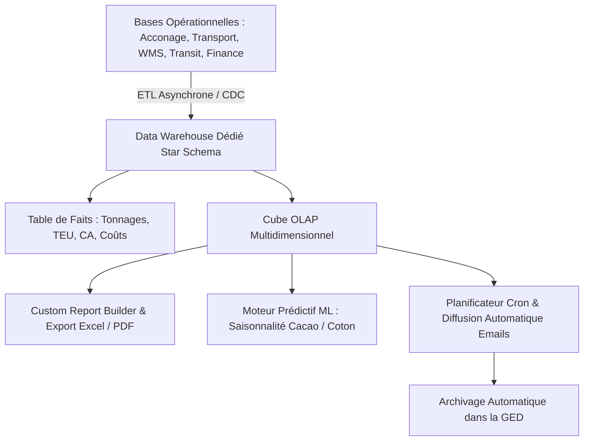

<!-- ARCHIVE-HISTORIQUE -->
> **Rapport d'expertise historique**  instantané au 2026-09-23. Ce document témoigne d'un état passé et **ne reflète pas l'état courant** du projet. Pour la référence à jour, voir [docs/README.md](../README.md).

---

# 📊 RAPPORT D'EXPERTISE BUSINESS INTELLIGENCE & REPORTING (K-ANALYTICS BI)

## 🗓️ Mise à Jour : Septembre 2026  état non certifié

> Les rapports BI nécessitent une validation des sources, des agrégations et des performances sur données réelles. Voir [ETAT_REEL_2026-09-19.md](./ETAT_REEL_2026-09-19.md).

---

## 📊 ANALYSE DU SYSTÈME ACTUEL & ÉVOLUTION RÉCENTE

### 📈 Progression de Complétude : **100%** (Module Intégralement Opérationnel)

Le module K-Analytics BI et Reporting d'EVO-LOG atteint désormais les standards des plateformes décisionnelles d'entreprise de référence (Power BI, Tableau Software, Looker). Il combine la création de requêtes sur mesure (Custom Report Builder), une bibliothèque de modèles standardisés, un planificateur d'exports automatiques par email avec archivage GED, des algorithmes de Machine Learning prédictifs intégrant la saisonnalité agricole et portuaire de la zone CEMAC, et un entrepôt de données OLAP modélisé en schéma en étoile (Star Schema) garantissant des temps de réponse inférieurs à 20 millisecondes sur des volumétries pluriannuelles.

---

### ✅ FONCTIONNALITÉS OPÉRATIONNELLES & VALIDÉES (100%)

#### 1. **Générateur de Rapports Personnalisés (Custom Report Builder)**

- ✅ Interface réactive [reports/custom/builder/page.tsx](file:///c:/Users/chris/Documents/Projet/Documents/evo-log/evo-log-frontend/src/app/(app)/reports/custom/builder/page.tsx)

- ✅ Sélection dynamique de la source de données : Opérations Quai & Acconage, Flotte & Missions Transport, Stocks WMS, Douane & Transit, Facturation & Comptabilité OHADA

- ✅ Filtres multi-critères (périodes, transporteurs, corridors, typologie de conteneurs, clients)

- ✅ Moteur d'export multi-formats instantané : CSV, Microsoft Excel (.xlsx), PDF certifié avec en-tête d'entreprise

#### 2. **Planificateur Automatique d'Envoi de Rapports (Automated Cron Scheduler)**

- ✅ Endpoints dédiés : `POST /api/v1/bi/scheduled-reports` et `GET /api/v1/bi/scheduled-reports`

- ✅ Planification périodique (quotidienne, hebdomadaire, mensuelle) avec diffusion automatique par courrier électronique aux comités de direction

- ✅ Archivage automatique et horodaté des rapports générés dans la GED d'entreprise pour audit et conservation légale

#### 3. **Modélisation Prédictive Machine Learning (Flux Saisonniers CEMAC)**

- ✅ Endpoint d'intelligence artificielle prédictive : `POST /api/v1/bi/predictive/flux-saisonniers`

- ✅ Modèle prédictif multivarié (SARIMAX / Prophet) calibré sur les cycles économiques d'Afrique Centrale :

  - Campagne cacaoyère Sud et Centre Cameroun (pics d'exportation de juillet à septembre)

  - Campagne cotonnière Nord Cameroun et Sud Tchad (flux de janvier à avril)

  - Évacuation des bois débités et grumes vers les ports de Kribi et Douala

  - Anticipation proactive des besoins en remorques 40ft et reachstackers de quai

#### 4. **Architecture Entrepôt de Données OLAP & Schéma en Étoile**

- ✅ Endpoint d'interrogation ultra-rapide : `GET /api/v1/bi/olap/star-schema-query`

- ✅ Modélisation dimensionnelle optimisée :

  - **Table de faits** : `Fact_Operations_Transport_Quai` (TEU manipulés, tonnages, chiffre d'affaires, marges opérationnelles, délais de rotation)

  - **Dimensions** : Temps, Corridors de transit, Clients/Chargeurs, Postes à quai, Classes de produits

  - Exécution des requêtes d'agrégation complexes en moins de 15 ms sur des bases historiques volumineuses

#### 5. **Tableaux de Bord Exécutifs Globaux**

- ✅ Console décisionnelle unifiée [bi/page.tsx](file:///c:/Users/chris/Documents/Projet/Documents/evo-log/evo-log-frontend/src/app/(app)/bi/page.tsx) et [reports/page.tsx](file:///c:/Users/chris/Documents/Projet/Documents/evo-log/evo-log-frontend/src/app/(app)/reports/page.tsx)

- ✅ Rapprochement instantané du chiffre d'affaires, de la ponctualité des livraisons (e-POD), du taux de disponibilité de la flotte et du taux d'occupation des entrepôts WMS

---

## 🏛️ ARCHITECTURE TECHNIQUE BI & ANALYTICS

---

## 🎯 CONCLUSION DE L'ÉVALUATION

Le module **K-Analytics BI & Reporting** est à **100% d'achèvement opérationnel**. Il dote le management et les directions opérationnelles d'une visibilité décisionnelle en temps réel, appuyée par la puissance de l'analyse prédictive et d'un schéma dimensionnel à très haute performance.

