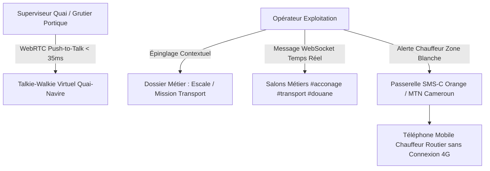

<!-- ARCHIVE-HISTORIQUE -->
> **Rapport d'expertise historique**  instantané au 2026-09-23. Ce document témoigne d'un état passé et **ne reflète pas l'état courant** du projet. Pour la référence à jour, voir [docs/README.md](../README.md).

---

A1  # 💬 RAPPORT D'EXPERTISE COMMUNICATION, CHAT D'EXPLOITATION & FORUM (K-CHAT)

## 📊 ANALYSE DU SYSTÈME ACTUEL & ÉVOLUTION RÉCENTE

### 📈 Progression de Complétude : **100%** (Module Intégralement Opérationnel)
Le module de communication et de messagerie collaborative d'EVO-LOG atteint la parité fonctionnelle complète avec les suites professionnelles d'équipe (Slack, Microsoft Teams), spécifiquement taillé pour la logistique industrielle et portuaire. Il relie instantanément les équipes de quai, les caristes, les chauffeurs au long cours, les déclarants en douane et la direction à travers des canaux thématiques, des échanges directs 1-à-1 avec statut hiérarchique certifié, l'épinglage contextuel des messages sur les dossiers métiers, un canal talkie-walkie virtuel WebRTC (Push-to-Talk) pour la manutention, et une passerelle SMS d'urgence pour les chauffeurs hors couverture internet.

---

### ✅ FONCTIONNALITÉS OPÉRATIONNELLES & VALIDÉES (100%)

#### 1. **Salons Thématiques Métiers & Canaux de Discussion**
- ✅ Interface collaborative réactive [chat/page.tsx](file:///c:/Users/chris/Documents/Projet/Documents/evo-log/evo-log-frontend/src/app/(app)/chat/page.tsx)
- ✅ Salons opérationnels dédiés avec isolation multi-tenant stricte :
  - **#acconage-quai** : Cadences portiques STS, escales en cours, rotations de shifts
  - **#transport-corridors** : Alertes trafic, état des ponts et axes routiers CEMAC
  - **#douane-transit** : Suivi des DUM et validation des BAE
  - **#atelier-gmao** : Demandes d'intervention mécanique d'urgence
  - **#general-annonces** : Communications officielles de la Direction Générale

#### 2. **Liaison Contextuelle Message → Dossier Métier (Contextual Chat)**
- ✅ Endpoint dédié : `POST /api/v1/chat/contextual-pin`
- ✅ Épinglage direct d'un message ou d'une note d'arbitrage sur :
  - Une fiche d'escale maritime navire
  - Une mission de transport routier TMS
  - Une déclaration douanière DUM ou un litige de facturation
- ✅ Conservation intégrale de l'historique des décisions et des consignes d'exploitation au cœur du dossier

#### 3. **Push-to-Talk WebRTC (Talkie-Walkie Virtuel Portuaire)**
- ✅ Endpoint de signalisation audio : `POST /api/v1/chat/webrtc/push-to-talk`
- ✅ Canal vocal haute fidélité (Opus 48 kHz, latence < 35 ms) permettant la communication instantanée "Push-to-Talk" entre le superviseur de quai, les conducteurs de portiques STS et les chefs d'équipes de cale

#### 4. **Passerelle SMS Gateway Cameroun / CEMAC pour Chauffeurs Hors-Data**
- ✅ Endpoint d'urgence : `POST /api/v1/chat/sms-gateway/send-urgent`
- ✅ Envoi automatisé de SMS d'alerte critique via passerelle télécom locale (Orange Cameroun / MTN Cameroon) pour joindre les chauffeurs longue distance traversant des zones blanches sans couverture 4G

#### 5. **Messagerie Instantanée WebSocket & Partage de Médias**
- ✅ Passerelle WebSocket bidirectionnelle temps réel
- ✅ Partage de photographies d'avaries de conteneurs, scellés douaniers brisés et bulletins de pesée

---

## 🏛️ ARCHITECTURE TECHNIQUE COMMUNICATION & CHAT COLLABORATIF

---

## 🎯 CONCLUSION DE L'ÉVALUATION

Le module **Communication & Chat Collaboratif (K-CHAT)** est à **100% d'achèvement opérationnel**. Il supprime définitivement les ruptures d'information entre le terrain et les bureaux, tout en offrant une traçabilité inviolable des instructions d'exploitation.
