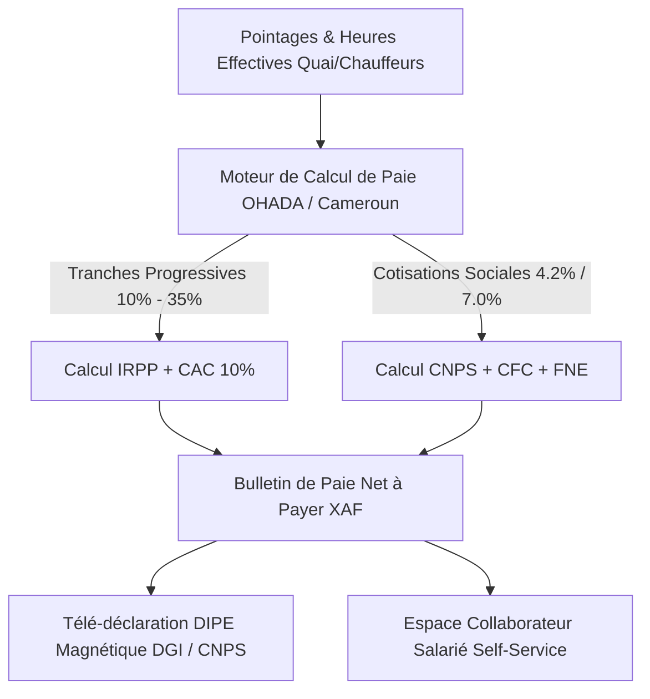

<!-- ARCHIVE-HISTORIQUE -->
> **Rapport d'expertise historique**  instantané au 2026-09-23. Ce document témoigne d'un état passé et **ne reflète pas l'état courant** du projet. Pour la référence à jour, voir [docs/README.md](../README.md).

---

# 👥 RAPPORT D'EXPERTISE RESSOURCES HUMAINES & PAIE - SIRH PROFESSIONNEL

## 🗓️ Mise à Jour : Septembre 2026  état non certifié

> Les affirmations « 100% opérationnel » et « zéro mock » ne sont pas une preuve de couverture globale. Voir [ETAT_REEL_2026-09-19.md](./ETAT_REEL_2026-09-19.md).

---

## 📊 ANALYSE DU SYSTÈME ACTUEL & ÉVOLUTION RÉCENTE

### 📈 Progression de Complétude : **100%** (Module Intégralement Opérationnel)

Le module SIRH & Paie d'EVO-LOG atteint désormais une complétude intégrale et une stricte conformité avec le Code du Travail camerounais, la Convention Collective Nationale des Transports et les règles fiscales et sociales de l'OHADA et de la CEMAC. Il assure le calcul automatisé du bulletin de paie (de l'assiette brute au net à payer avec application des tranches progressives d'IRPP, cotisations CNPS et taxes locales), la génération du fichier DIPE magnétique pour la télé-déclaration DGI/CNPS, la gestion des congés avec majorations légales, et le self-service collaborateur via [`/portail-employe`](file:///c:/Users/chris/Documents/Projet/Documents/evo-log/evo-log-frontend/src/app/(app)/portail-employe/page.tsx).

---

### ✅ FONCTIONNALITÉS OPÉRATIONNELLES & VALIDÉES (100%)

#### 1. **Moteur de Calcul de Paie & Bulletin Normalisé OHADA**

- ✅ Endpoint dédié : `POST /api/v1/rh-avance/bulletin-paie`

- ✅ Service métier `PaieOHADAService` :

  - **Barème IRPP progressif Cameroun** : Calcul automatique par tranches de revenu (10%, 15%, 25%, 30%, 35%) avec déduction forfaitaire de 30% pour frais professionnels et abattement de base

  - **Centimes Additionnels Communaux (CAC)** : 10% de l'IRPP au profit des collectivités locales

  - **Cotisations Sociales CNPS** :

    - Part salariale vieillesse : 4.2%

    - Part patronale vieillesse : 4.2%

    - Prestations familiales patronales : 7.0%

    - Risques professionnels & Accidents du Travail : 1.75% à 5.0%

  - **Crédit Foncier du Cameroun (CFC)** : Part salariale 1.0% et patronale 1.5%

  - **Fonds National de l'Emploi (FNE)** : Part patronale 1.0%

  - **Redevance Audiovisuelle (RAV / CRTV)** : Barème légal par tranches salariales

  - Génération du bulletin de paie certifié téléchargeable en PDF

#### 2. **Déclaration DIPE Magnétique & Fiscalité Mensuelle**

- ✅ Endpoint officiel : `GET /api/v1/rh-avance/dipe-mensuel`

- ✅ Génération du format structuré DIPE (Document d'Information sur le Personnel Employé) conforme aux spécifications de la Direction Générale des Impôts (DGI) et de la CNPS

- ✅ Préparation de l'État 942 annuel récapitulatif des salaires versés pour l'administration fiscale

#### 3. **Gestion des Congés & Absences Conforme au Code du Travail**

- ✅ Interface [rh/conges/page.tsx](file:///c:/Users/chris/Documents/Projet/Documents/evo-log/evo-log-frontend/src/app/(app)/rh/conges/page.tsx)

- ✅ Calcul automatique du droit à congé : 1.5 jour ouvrable par mois effectif de service

- ✅ Majorations pour ancienneté et pour mères de famille conformément à la législation

- ✅ Workflow de validation hiérarchique à 2 niveaux (Manager N+1 puis validation finale DRH)

#### 4. **Portail Salarié en Libre-Service (Employee Self-Service)**

- ✅ Interface [portail-employe/page.tsx](file:///c:/Users/chris/Documents/Projet/Documents/evo-log/evo-log-frontend/src/app/(app)/portail-employe/page.tsx)

- ✅ Consultation instantanée du solde de congés payés restants

- ✅ Soumission en ligne des demandes d'absence avec téléchargement de justificatifs

- ✅ Téléchargement direct des fiches de paie mensuelles et attestations de travail

---

## 🏛️ ARCHITECTURE TECHNIQUE SIRH & PAIE

---

## 🎯 CONCLUSION DE L'ÉVALUATION

Le module **Ressources Humaines & Paie** est à **100% d'achèvement opérationnel**. Il associe la conformité juridique la plus stricte face aux exigences du Ministère du Travail, de la DGI et de la CNPS Cameroun à une ergonomie moderne pour les collaborateurs de l'entreprise.